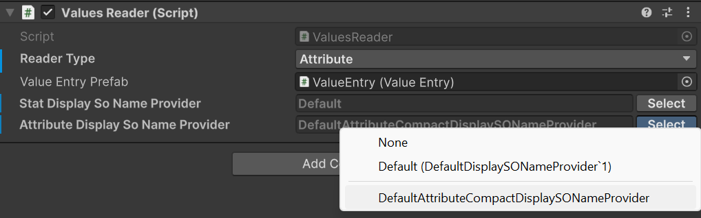
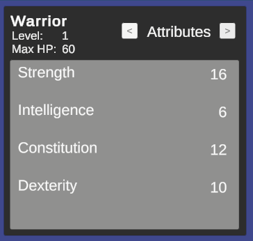

# Advanced topics

## Presentation layer and localization
*🏷️ Version 1.2.0+*

The framework focuses on the business logic of RPG systems and does not impose any specific presentation layer or localization strategy. You are free to implement your own UI and localization solutions that best fit your project's needs.
However, the framework provides basic support for the presentation layer by allowing you to define display names for attributes, statistics, and classes. These display names can be used in your UI to present information to players in a user-friendly manner.
In fact, ScriptableObjects names are convenient and quick to use during development, but they are not ideal for presentation to players. By defining display names, you can separate the internal representation of your RPG systems from the user-facing presentation layer.

### `IDisplaySONameProvider`

The framework includes the `IDisplaySONameProvider` interface, which can be implemented by UI components to display readable names for attributes, statistics, and classes:  
```csharp
public interface IDisplaySONameProvider<in T> where T : ScriptableObject
{
    string GetDisplayName(T asset);
}
```

The framework provides a default implementation of this interface, `DefaultDisplaySONameProvider`, which retrieves the ScriptableObject's name and returns it as the display name. You can use this default implementation or create your own custom implementation to suit your localization needs.

The attributes are a particular as in many RPGs they can either be presented with the extended name (e.g., "Strength") or with an abbreviation (e.g., "STR"). To accommodate this, the framework provides the `DefaultAttributeCompactDisplaySONameProvider` implementation, which returns the first three letters, capitalized, as the display name for a certain attribute.

### Using custom display name providers

To use a custom display name provider, you can instantiate your implementation in your own scripts, or rely on the `TypeSelectable` attribute provided by the framework to select the implementation from the Unity inspector. For example:  
```csharp
[SerializeReference, TypeSelectable(typeof(DefaultDisplaySONameProvider<Attribute>))]
private IDisplaySONameProvider<Attribute> _attributeDisplayNameProvider;
```
`TypeSelectable` is an experimental feature of the framework that allows you to select a concrete implementation of an interface from the Unity inspector.  
The parameter passed to `TypeSelectable` is the default implementation that will be selected when the inspector is first displayed. You can then choose a different implementation from a dropdown list in the inspector.
If you take a look at the demo scene, if you select the `AttributesContainer` GameObject inside `WarriorCanvas -> HeroPanel` in the hierarchy, you will see a `Attribute Display So Name Provider` field in the inspector under the `Values Reader` component. This field uses the `TypeSelectable` attribute to allow you to choose between the default and compact display name providers for attributes.  


The implementation passed as parameter to `TypeSelectable` will be instantiated automatically by the framework during script compilation. Moreover, the framework will show it in the inspector, in the dropdown list, as the Default option under `None`.

During Play Mode, you can switch between the different implementations to see how the display names change in the UI of the sample scene.
With the default implementation, the attributes will be displayed with their full names:  


With the compact implementation, the attributes will be displayed with their abbreviations:  
