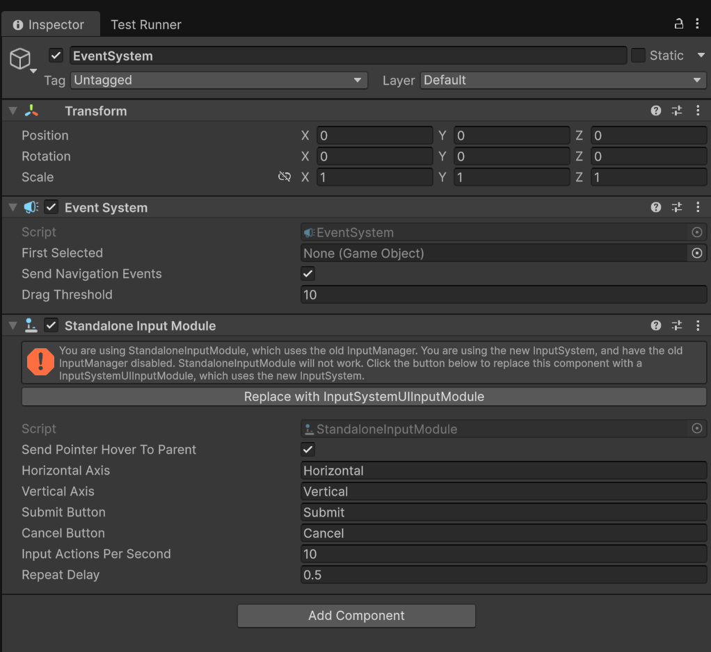

# Installation instructions

## Importing Astra RPG Framework and its samples

1. From the package manager, import Astra RPG Framework. You can find the package in the "My Assets" section.
2. After importing, head to the "In Project" section, always in the Package Manager, and click on "AstraRPGFramework".
3. Click on the "Samples" tab and import the samples you desire. Find out more about the samples in the [Samples documentation](./samples.md).
4. If you imported the "Example scene and instances" samples you need to import also TextMeshPro Essentials. Click on "Window > TextMeshPro > Import TMP Essential Resources".

## Unity 6.2 and above extra steps for having the sample scene working

If you are using Unity 6.2 or above, and you imported the "Example scene and instances" samples, you need to do the following extra steps to have the sample scene working:
1. Open the "SampleScene" scene located in "Assets/Samples/AstraRPGFramework/[version of the package]/Example scene and instances/SampleScene".
2. Select the "EventSystem" GameObject in the Hierarchy.
3. In the Inspector, find the "Standalone Input Module" component. You should see an error like:
  
4. Click on "Replace with InputSystemUIInputModule".

The sample scene should now work correctly.

I am working on a fix to avoid having to do these extra steps in future versions of the package, while preserving compatibility with Unity versions below 6.2.
