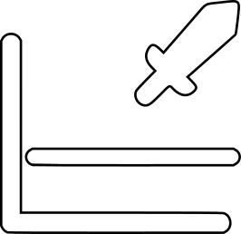
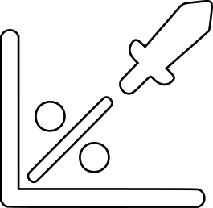
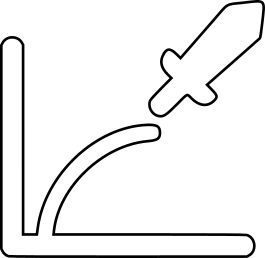
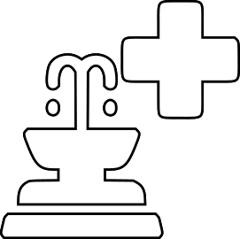
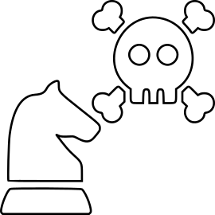

> [!NOTE]
> Join the Astra RPG Discord server!  
> There is now a dedicated **Discord server** for Astra RPG Framework and its extensions.
> Join to **receive notifications** about new extension releases and important updates, **ask for new features**, **report bugs**, **share ideas**, and **showcase your Astra creations** with other developers.  
> 💬 Join the Discord Server: https://discord.gg/nJVRMkGrZg

# Introduction

<!--
- Health Scaling Component
- Health
- Damage & Calculation pipeline
- Tmp HP
- Damage Reduction
- Defense Piercing
- Damage Types
- Damage Sources
- Heal Sources
- Lifesteal
- Death & Resurrection
-->

Astra RPG Health extends the base framework, , by adding functionality for managing health and calculating damage for entities.
The package is designed with the same design philosophy as the base asset: a Scriptable Object-based architecture to encourage flexibility, modularity, and testability. If you're already familiar with the base package, you'll feel right at home with its features.

You can define your own damage types, designate defensive statistics used to reduce each damage type, configure the damage calculation pipeline with the desired steps, configure lifesteal for certain damage types, define strategies to execute upon entity death, and much more.

## Astra RPG Health Vocabulary

### Damage Type
Damage types represent the different categories of damage that can be inflicted on entities. Common examples include "Physical", "Magical", "Bleeding", "Drowning", etc. You can create custom damage types to suit your game's needs.

### Damage Source
Damage sources represent the origin of the damage inflicted. This is highly specific to your game's context. For example, one game might have damage sources such as "Entity", "Environment", "Potion", etc., while another might want to define more specific damage sources like "Attack", "Spell", "Equipment", "Trap", "Environment", "Damage Over Time", etc.
The main difference between damage source and damage type is that damage types categorize damage based on its nature, while damage sources identify where the damage originates. The distinction can be subtle, but it's important for game logic and mechanics. We'll return to these concepts later, where we'll see the practical differences between the two.

### Heal Source
Heal sources represent the origin of healing. Similar to damage sources, heal sources are specific to your game's context. Common examples include "Potion", "Spell", "Lifesteal", "Ability", "Environment", etc. In some games, a classic Heal Source definition might include "Self" and "Ally", as these enable mechanics for increasing healing provided/received based on the caster and target.

### Barrier
The concept of temporary HP can take various names across different games, though the underlying mechanic remains the same: provide an amount of extra and ephemeral hit points that are deducted instead of health when damage is taken. In Astra, these temporary hit points are called "Barrier".

### Raw and Net Damage
Raw Damage refers to the damage that a certain attack or skill intends to inflict. This damage does not account for resistances, critical hits, modifiers, etc.
Net Damage is the result of processing Raw Damage while accounting for damage modifiers, resistances, barriers, critical hits, etc.

### Damage Modifiers
Damage modifiers are components that can alter calculated damage in various ways. They can be used to implement mechanics such as damage reduction, damage increase, resistances, vulnerabilities, and more. Damage modifiers are generally utilized by the damage calculation pipeline (which we'll see shortly).

## How is Astra RPG Health organized and how does it work?

###  Astra RPG Health Config
The `AstraRPGHealthConfig` is a `ScriptableObject` that serves as the central configuration point for the Astra RPG Health package. It has several properties that allow you to define how the health and damage systems should behave in your game.

With Astra RPG Framework, no configuration was needed. However, Astra RPG Health needs to be configured to work around the actual instances of the base framework's components defined for your game. For example, if you defined a certain statistic for general damage reduction in your game with Astra RPG Framework, you need to inform Astra RPG Health about it so that it can use it when calculating damage.
The needed configuration is kept minimal, and convention-over-configuration is applied where possible to reduce the amount of setup required.  
Configuration will be deeply discussed later in [Workflows](workflows.md).

###  EntityHealth
`EntityHealth` is a brand new `MonoBehaviour` that you can add to your entities to provide them with health management capabilities. Worth mentioning, it exposes the most important method of the package: `TakeDamage()`, which allows you to inflict damage on the entity.

###  Damage Type
`DamageType` is a `ScriptableObject` that represents a specific type of damage. Each damage type can be optionally configured with a defensive `Stat` that will be used to reduce incoming damage of that type. If a defensive stat is assigned, also a piercing stat can be assigned to ignore a portion of the defense when calculating damage.  
Both for the defensive and piercing stat, you can select a `DamageReductionFormula` and a `DefenseReductionFormula` respectively, to define how the stats will affect damage reduction and defense piercing.

###  Damage Source
`DamageSource`, derived from `ScriptableObject`, represents the origin of the damage inflicted. They don't have any specific properties, but they can be assigned to other objects of the package to create specific behaviors based on the damage source. We will see for what and how in the [Workflows](workflows.md) section.

###    Damage Reduction Functions
The package comes with three built-in `DamageReductionFunction`s that you can use to define how defensive stats reduce incoming damage:
- `FlatDamageReductionFn`: Reduces damage by a flat amount based on the defense stat value.
- `PercentageDamageReductionFn`: Reduces damage by a percentage based on the defense stat value.
- `LogarithmicDamageReductionFn`: Reduces damage using a logarithmic scale based on the defense stat value. 

In case of need, custom damage reduction functions can be created by extending the `DamageReductionFn` class.

###    Defense Piercing Functions
As for damage reduction functions, the package comes with three built-in `DefensePiercingFunction`s that you can use to define how piercing stats ignore a portion of the defense stat:
- `FlatDefensePiercingFn`: Ignores a flat amount of the defense stat based on the piercing stat value.
- `PercentageDefensePiercingFn`: Ignores a percentage of the defense stat based on the piercing stat value.
- `LogarithmicDefensePiercingFn`: Ignores a portion of the defense stat using a logarithmic scale based on the piercing stat value.

Also in this case, custom defense piercing functions can be created by extending the `DefensePiercingFn` class.

###  Heal Source
`HealSource`, derived from `ScriptableObject`, represents the origin of healing. Similar to `DamageSource`, they don't have any specific properties, but they can be assigned to other objects of the package to create specific behaviors based on the heal source. We will see for what and how in the [Workflows](workflows.md) section.

###  Damage Calculation Strategy
The damage calculation pipeline is the component of the framework responsible for processing raw damage and producing net damage. The pipeline will use a given `DamageCalculationStrategy` to determine the sequence of steps to apply when calculating damage.  
Therefore, a `DamageCalculationStrategy` is a `ScriptableObject` that defines a sequence of `DamageStep`s to be executed in order when calculating damage.

###  Death Strategy
A `DeathStrategy` is a `ScriptableObject` that, by relying on the strategy programming pattern, allows you to define different behaviors upon entity death.  
When an entity's health reaches zero, a `DeathStrategy` is used to determine what actions should be taken.  
Strategies can be game-oriented, such as "Respawn", "Game Over", or "Drop Loot", or they can serve more technical purposes, like "Disable GameObject", "Play Death Animation", or "Return to Pool", etc.

Astra RPG Health includes several predefined technical death strategies:
- `DisableOnDeathStrategy`: Disables the entity's GameObject upon death. Useful if the entity can be resurrected or reused later.
- `DestroyOnDeathStrategy`: Destroys the entity's GameObject upon death. Useful for entities that should not be reused. This is simpler and more immediate than using pooling when pooling is not needed.
- `DoNothingOnDeathStrategy`: Performs no action upon death. Useful for testing or debugging.
- `MultipleOnDeathStrategy`: Sometimes, you need to combine multiple strategies to achieve the desired behavior. For example, for enemies, you might want to drop loot, play a death animation, and destroy the GameObject (or return it to a pool if available). For this purpose, the framework includes a strategy that allows you to combine multiple death strategies in sequence.

You can also create custom death strategies by extending the `OnDeathStrategy` class. This allows you to implement death behaviors specific to your game's architecture and combine them with the predefined strategies in a `Multiple Death Strategy` if needed to achieve the desired result.

###  Resurrection Strategy
Similar to `DeathStrategy`, a `ResurrectionStrategy` is a `ScriptableObject` that allows you to define different behaviors upon entity resurrection.  
When an entity is resurrected, a `ResurrectionStrategy` is used to determine what actions should be taken.  
Astra RPG Health includes some predefined resurrection strategies:
- `EnableOnResurrectionStrategy`: Enables the GameObject of the entity upon resurrection. Useful if the entity's GameObject was disabled upon death.
- `DoNothingOnResurrectionStrategy`: Performs no action upon resurrection. Useful for testing or debugging.
- `MultipleOnResurrectionStrategy`: Similar to the multiple death strategy, this strategy allows you to combine multiple resurrection strategies in sequence.

Also in this case, you can create custom resurrection strategies by extending the `OnResurrectionStrategy` class to implement resurrection behaviors specific to your game's architecture.

###  Lifesteal Configuration
`LifestealConfig`, deriving from ScriptableObject, allows you to define how lifesteal mechanics work for specific damage types. This allows to bind a statistic to each damage type you want to have lifesteal for. That statistic will be used to calculate the amount of health to restore to the attacker when they deal damage of that type.  
The configuration allows also to configure the damage pipeline timing of the lifesteal effect. For example, you might want lifesteal to occur before or after damage reduction is applied. We will see this in detail later in the [Workflows](workflows.md) section.

###  Health Scaling Component
Astra RPG Health provides a brand new `HealthScalingComponent` that you can use in your `ScalingFormula`s to have skills or abilities scale based on either the attacker or the target's health. You can choose to scale upon one or more among Maximum HP, Current HP, and Missing HP.

###  More Game Events
Astra RPG Health comes with many new Game Events that you can use to react to health&damage-related events in your game. Some of the most important ones are:
- `PreDamageGameEvent`: Triggered before damage is applied to an entity. Useful for modifying or canceling damage. Use this for implementing custom passives or effects that need to react before damage is taken.
- `DamageResolutionGameEvent`: Triggered when an entity takes damage. Can be used to react to damage being applied.
- `EntityDiedGameEvent`: Triggered when an entity dies.
- `EntityHealedGameEvent`: Triggered when an entity is healed.
- `EntityResurrectedGameEvent`: Triggered when an entity is resurrected.
And many more events. We will discuss them in detail later in the [Workflows](workflows.md) section.