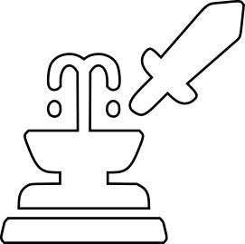
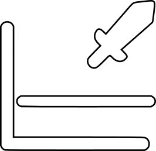
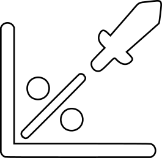
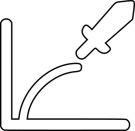
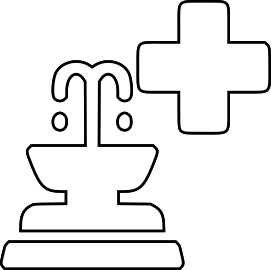
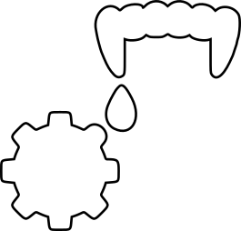

> [!NOTE]
> Join the Astra RPG Discord server!  
> There is now a dedicated **Discord server** for Astra RPG Framework and its extensions.
> Join to **receive notifications** about new extension releases and important updates, **ask for new features**, **report bugs**, **share ideas**, and **showcase your Astra creations** with other developers.  
> 💬 Join the Discord Server: https://discord.gg/nJVRMkGrZg

# Introduction

<!--
- Health Scaling Component
- Health
- Damage & Calculation pipeline
- Tmp HP
- Damage Reduction
- Defense Piercing
- Damage Types
- Damage Sources
- Heal Sources
- Lifesteal
- Death & Resurrection
-->

Astra RPG Health extends the base framework, , by adding functionality for managing health and calculating damage for entities.
The package is designed with the same design philosophy as the base asset: a Scriptable Object-based architecture to encourage flexibility, modularity, and testability. If you're already familiar with the base package, you'll feel right at home with its features.

You can define your own damage types, designate defensive statistics used to reduce each damage type, configure the damage calculation pipeline with the desired steps, configure lifesteal for certain damage types, define strategies to execute upon entity death, and much more.

## Astra RPG Health Vocabulary

### Damage Type
Damage types represent the different categories of damage that can be inflicted on entities. Common examples include "Physical", "Magical", "Bleeding", "Drowning", etc. You can create custom damage types to suit your game's needs.

### Damage Source
Damage sources represent the origin of the damage inflicted. This is highly specific to your game's context. For example, one game might have damage sources such as "Entity", "Environment", "Potion", etc., while another might want to define more specific damage sources like "Attack", "Spell", "Equipment", "Trap", "Environment", "Damage Over Time", etc.
The main difference between damage source and damage type is that damage types categorize damage based on its nature, while damage sources identify where the damage originates. The distinction can be subtle, but it's important for game logic and mechanics. We'll return to these concepts later, where we'll see the practical differences between the two.

### Heal Source
Heal sources represent the origin of healing. Similar to damage sources, heal sources are specific to your game's context. Common examples include "Potion", "Spell", "Lifesteal", "Ability", "Environment", etc. In some games, a classic Heal Source definition might include "Self" and "Ally", as these enable mechanics for increasing healing provided/received based on the caster and target.

### Barrier
The concept of temporary HP can take various names across different games, though the underlying mechanic remains the same: provide an amount of extra and ephemeral hit points that are deducted instead of health when damage is taken. In Astra, these temporary hit points are called "Barrier".

### Raw and Net Damage
Raw Damage refers to the damage that a certain attack or skill intends to inflict. This damage does not account for defense, critical hits, modifiers, etc.
Net Damage is the result of processing Raw Damage while accounting for damage modifiers, damage reduction, barriers, critical hits, etc.

### Damage Reduction and Defense Piercing
Primary damage reduction occurs through defensive statistics, which reduce damage based on their value and the assigned damage reduction formula. Each Damage Type can be configured with a specific defensive statistic that will be used to reduce damage of that type. For example, a `Physical Damage` Damage Type could be configured to be reduced by an `Armor` statistic.

Defense Piercing, instead, represents the ability to ignore part or all of the defensive statistic assigned to a Damage Type. Each Damage Type can be configured with a specific piercing statistic that will be used to ignore a portion of the defense when calculating damage. For example, the `Armor Penetration` statistic could be used to determine how much of the `Armor` to ignore when calculating the net damage of an attack that inflicts `Physical Damage`.

### Damage Modifiers
Damage modifiers are a low-level abstraction that can alter net damage. They represent either flat or percentage-based modifications to the damage an entity receives. They can be general, applying to all damage received by the entity, or specific to a certain damage type or source.  
They are the foundation for implementing a wide range of mechanics — such as elemental resistances and vulnerabilities, status effects, buffs, and debuffs — that affect the damage received based on varying conditions and contexts. Whether a modifier is temporary or permanent depends entirely on the higher-level logic built on top of them. Damage modifiers are generally utilized by the damage calculation pipeline (which we'll see shortly).

### Damage Modifiers vs. Stat-Based Damage Reduction
These are distinct concepts. Stat-based damage reduction (via defensive stats) is the **baseline**: entities are always expected to carry a meaningful value for each defensive stat, and that value **always reduces** incoming damage of the associated type. Damage Modifiers, on the other hand, are backed by stats that **default to zero** — meaning they have no effect unless a higher-level system (e.g. a resistance, a weakness, a status effect) changes their value. Additionally, while defensive stats can only ever reduce damage, damage modifiers can go in either direction: **reducing or amplifying** the damage received. Finally, defensive stats often also carry an explicit semantic meaning in the game world. For example, an `Armor` stat clearly indicates a defensive capability that reduces physical damage, and an heavier equipped armor values grants a greater `Armor` value.

Damage modifiers are a more abstract, low-level tool that can be used to implement many different mechanics; they do not carry an inherent, universal meaning. They act as a shared container for damage modifiers coming from various game mechanics. For example, a `Stone Skin` buff, a `Iron Elixir` potion, and a `Barbarian Temper` passive ability, could all rely on the same `Flat Physical Damage Modifier` stat to reduce physical damage. In this case, the `Flat Physical Damage Modifier` stat would be a shared resource that all these mechanics modify to achieve their effect on damage reduction.

The **origin of val values** also differs between the two. Defensive stat values are typically set either as a fixed base value on the entity, or derived from its Class's `GrowthFormula` if classes are used — meaning they scale naturally with the entity's progression. Damage modifier stats, by contrast, usually rely on **flat stat modifiers**: each game mechanic (potion, passive, buff, debuff, etc.) contributes its effect by adding or removing a stat modifier on the underlying stat, temporarily or permanently altering the total modifier applied to incoming damage.

|  | **Defensive Stat Damage Reduction** | **Damage Modifiers** |
|---|---|---|
| **Default effect** | Always active — entities carry a (usually) non-zero defensive stat that continuously reduces incoming damage | Neutral by default — the underlying stat starts at zero and has no effect until explicitly changed |
| **Direction** | Can only **reduce** damage | Can **reduce or increase** damage |
| **Scope** | Specific to a **Damage Type** — each type can have at most one defensive stat assigned. No reduction exists for Damage Sources | Can target **all damage** (any type and source), a **specific Damage Type**, or a **specific Damage Source** |
| **Nature** | Derived from a defensive stat value, processed through a damage reduction formula | Flat or percentage-based modifications driven by higher-level systems (resistances, weaknesses, status effects, etc.) |
| **Duration** | Permanent — tied to the entity's stat value | Temporary or permanent, depending on the higher-level systems that apply them |
| **Value origin** | Set as a fixed base value on the entity, or derived from its Class's `GrowthFormula` | Driven by **flat stat modifiers** added or removed by individual game mechanics (potions, passives, buffs, debuffs, etc.) |

## How is Astra RPG Health organized and how does it work?

###  Astra RPG Health Config
The `AstraRPGHealthConfig` is a `ScriptableObject` that serves as the central configuration point for the Astra RPG Health package. It has several properties that allow you to define how the health and damage systems should behave in your game.

With Astra RPG Framework, no configuration was needed. However, Astra RPG Health needs to be configured to work around the actual instances of the base framework's components defined for your game. For example, if you defined a certain statistic for general damage reduction in your game with Astra RPG Framework, you need to inform Astra RPG Health about it so that it can use it when calculating damage.
The needed configuration is kept minimal, and convention-over-configuration is applied where possible to reduce the amount of setup required.  
Configuration will be deeply discussed later in [Package Configuration](workflows/package-configuration.md).

###  EntityHealth
`EntityHealth` is a brand new `MonoBehaviour` that you can add to your entities to provide them with health management capabilities. Worth mentioning, it exposes the most important method of the package: `TakeDamage()`, which allows you to inflict damage on the entity.

###  Damage Type
`DamageType` is a `ScriptableObject` that represents a specific type of damage. Each damage type can be optionally configured with a defensive `Stat` that will be used to reduce incoming damage of that type. If a defensive stat is assigned, also a piercing stat can be assigned to ignore a portion of the defense when calculating damage.  
Both for the defensive and piercing stat, you can select a `DamageReductionFormula` and a `DefenseReductionFormula` respectively, to define how the stats will affect damage reduction and defense piercing.

###  Damage Source
`DamageSource`, derived from `ScriptableObject`, represents the origin of the damage inflicted. They don't have any specific properties, but they can be assigned to other objects of the package to create specific behaviors based on the damage source. We will see for what and how in the Workflows.

###    Damage Reduction Functions
The package comes with three built-in `DamageReductionFunction`s that you can use to define how defensive stats reduce incoming damage:
- `FlatDamageReductionFn`: Reduces damage by a flat amount based on the defense stat value.
- `PercentageDamageReductionFn`: Reduces damage by a percentage based on the defense stat value.
- `LogarithmicDamageReductionFn`: Reduces damage using a logarithmic scale based on the defense stat value. 

In case of need, custom damage reduction functions can be created by extending the `DamageReductionFn` class.

###    Defense Piercing Functions
As for damage reduction functions, the package comes with three built-in `DefensePiercingFunction`s that you can use to define how piercing stats ignore a portion of the defense stat:
- `FlatDefensePiercingFn`: Ignores a flat amount of the defense stat based on the piercing stat value.
- `PercentageDefensePiercingFn`: Ignores a percentage of the defense stat based on the piercing stat value.
- `LogarithmicDefensePiercingFn`: Ignores a portion of the defense stat using a logarithmic scale based on the piercing stat value.

Also in this case, custom defense piercing functions can be created by extending the `DefensePiercingFn` class.

###  Heal Source
`HealSource`, derived from `ScriptableObject`, represents the origin of healing. Similar to `DamageSource`, they don't have any specific properties, but they can be assigned to other objects of the package to create specific behaviors based on the heal source. We will see for what and how in the Workflows.

###  Damage Calculation Strategy
The damage calculation pipeline is the component of the framework responsible for processing raw damage and producing net damage. The pipeline will use a given `DamageCalculationStrategy` to determine the sequence of steps to apply when calculating damage.  
Therefore, a `DamageCalculationStrategy` is a `ScriptableObject` that defines a sequence of `DamageStep`s to be executed in order when calculating damage.

###  On-death & on-resurrection `GameAction`s
Astra RPG Framework v1.4.0 introduced the concept of <TODO link here>GameAction: a modular and reusable unit of game logic that can be assigned via the inspector to various components to define custom behaviors.

Astra RPG Health leverages Game Actions to define custom behaviors when an entity dies or is resurrected. The framework allows you to assign a default on-death Game Action that will be executed when any entity dies, unless the entity has its own custom on-death Game Action assigned. Similarly, a default on-resurrection Game Action can be assigned to be executed when an entity is resurrected.

###  Lifesteal Configuration
`LifestealConfig`, deriving from ScriptableObject, allows you to define how lifesteal mechanics work for specific damage types. This allows to bind a statistic to each damage type you want to have lifesteal for. That statistic will be used to calculate the amount of health to restore to the attacker when they deal damage of that type.  
The configuration allows also to configure the damage pipeline timing of the lifesteal effect. For example, you might want lifesteal to occur before or after damage reduction is applied. We will see this in detail later in the Workflows.

###  Health Scaling Component
Astra RPG Health provides a brand new `HealthScalingComponent` that you can use in your `ScalingFormula`s to have skills or abilities scale based on either the attacker or the target's health. You can choose to scale upon one or more among Maximum HP, Current HP, and Missing HP.

###  Experience Collector
An `ExpCollector` is a `MonoBehaviour` that you can add to your entities to allow them to collect experience points from entities that die and have an  `ExpSource` component attached. The `ExpCollector` can be configured with different strategies ( `ExpCollectionStrategy`) to define under which conditions experience is collected from the dead entity.

###  Experience Collection Strategy
An `ExpCollectionStrategy` is a `ScriptableObject` that defines the logic for determining if an entity collects experience upon the death of another entity.

###  More Game Events
Astra RPG Health comes with many new Game Events that you can use to react to health&damage-related events in your game. Some of the most important ones are:
- `PreDamageGameEvent`: Triggered before damage is applied to an entity. Useful for modifying or canceling damage. Use this for implementing custom passives or effects that need to react before damage is taken.
- `DamageResolutionGameEvent`: Triggered when an entity takes damage. Can be used to react to damage being applied.
- `EntityDiedGameEvent`: Triggered when an entity dies.
- `EntityHealedGameEvent`: Triggered when an entity is healed.
- `EntityResurrectedGameEvent`: Triggered when an entity is resurrected.

And many more events. We will discuss them in detail later in the Workflows.