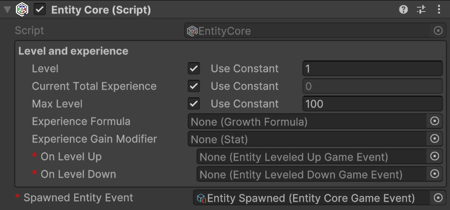
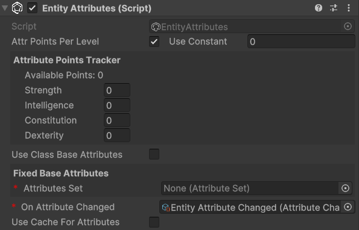
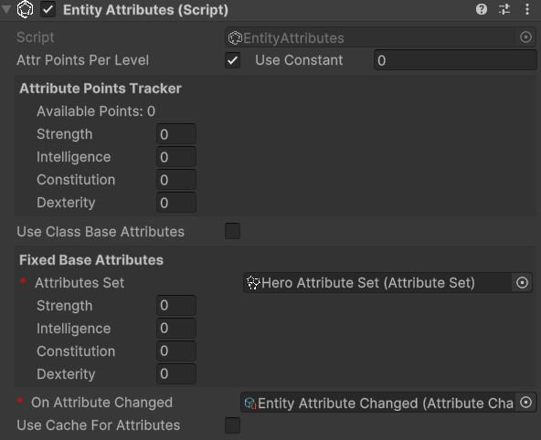

# Workflows
<!--
======UTILITIES
- Game Events as SOs
- Int and Long Vars
- Int and Long Refs
- Growth Formulas

======ENTITY
- Make a GameObject an entity
- EntityLevel

======ATTRIBUTES
- Create some Attributes
- Create an AttributeSet
    - Assign Attributes to an AttributeSet
- Add EntityAttributes to an entity

======STATS
- Create some Stats
    - Create AttributeScalingComponent for Stats
- Create a StatSet
    - Assign Stats to a StatSet
- Add EntityStats to an entity

======CLASS
- Create a class
- Add EntityClass to an entity
- Use class based entity attributes and stats

======SCALING FORMULA
- ScalingFormulas
- StatsScalingComponent
- AttributesScalingComponent
-->

## Creating instances of the objects
All the scriptable objects provided by the framework can be created through the Unity Editor by either right-clicking in the hierarchy and selecting `Create > Astra RPG` or navigating to the `Assets` menu at the top of the window and choosing `Create > Astra RPG`.

## Mandatory, re-play, and read-only fields
Fields marked with a red asterisk (<span style="color:red;">*</span>) are mandatory and must be filled out to ensure proper functionality of the framework.

Fields marked with an orange <strong style="color:orange;">R</strong> are re-play fields. Any changes made to these fields during playtime will require a restart to ensure the changes take effect.

Fields marked with a teal <strong style="color:teal;">RO</strong> are read-only fields. The framework manages these fields internally, and they cannot and should not be modified directly by the user.

## Some utilities
Almost every class provided by this package uses events or variables in the form of `ScriptableObject`. Therefore, let's quickly introduce these concepts so that we are clear about what we are talking about when we encounter them in the following paragraphs.

### Game events as `ScriptableObjects`
The Scriptable Objects based architecture allows us to implement the Observer pattern through scriptable objects. In the simplest case, with events without context, we can define various game events as `GameEvent` instances: a class that derives from `ScriptableObject`. For example, we can create an instance called `PlayerJumped` that represents the event "The player has jumped". This event will notify all listening systems when it occurs.
Systems subscribe to this event using the `MonoBehaviour` `GameEventListener`. We can assign a `GameEvent` to this component, and it will handle the subscription and invoke a callback when the event is triggered. The callback is a [UnityEvent](https://docs.unity3d.com/ScriptReference/Events.UnityEvent.html), so we can select a callback to invoke in response to our event directly from the inspector.

For more details, see the [Game Events section](#game-events).

### Int and Long Vars
Another common use of `ScriptableObject` in the SO based architecture is to define variables. The main advantage of these variables in the form of SO is that they can be easily shared between various objects that may decide to share the same value. A common example is the player's game score. There could be a game manager that adds or removes points from this variable, while the UI HUD uses it to display its value on the screen. This way, we can keep the game manager and UI completely decoupled, passing shared values (like variables) through the inspector.

From the code, we can access the values held by these variables using the `Value` getter and setter:
```csharp
// intVar is an instance of IntVar
int value = intVar.Value; // Get the value

// Thanks to implicit conversion, we can also use it as an int directly
int intValue = intVar; // Implicit conversion to int

intVar.Value = 10; // Set the value
```

### Int and Long Refs
`IntRef` and `LongRef` allow choosing whether to use a native value (`int` or `long`) or an `IntVar`/`LongVar`. As mentioned in the previous paragraph, `IntVar` and `LongVar` have the advantage of being shareable between different components/game objects, while native values are more immediate to use and require less setup (no need to instantiate an `IntVar`/`LongVar` and assign it in the inspector).

Thanks to a custom property drawer, it will be possible, from the inspector, to check a checkbox named `Use constant` to use a native value instead of a `Ref`, and vice versa.

`IntRef` and `LongRef` are widely used in the package's `MonoBehaviour`.

From the code, we can access the values held by these references using the `Value` getter and setter.
It is worth mentioning that when we use the setter, we need to provide a native `int` or `long` value. If `Use constant` is unchecked, this value will be assigned to the `Value` property of the referenced `IntVar` or `LongVar` instance; if `Use constant` is checked, the assignment only updates the local constant value and does not affect any referenced variable.
```csharp
// intRef is an instance of IntRef
int value = intRef.Value; // Get the value
// Thanks to implicit conversion, we can also use it as an int directly
int intValue = intRef; // Implicit conversion to int
intRef.Value = 10; // Set the value

// Assigns the value of intVar to intRef.Value using implicit conversion.
// Note: This does not change the IntVar reference held by intRef, only its value.
intRef.Value = intVar;
```

### Game events
The package also supports game events with up to 4 context parameters. They are generics, but in Unity, it is not possible to instantiate classes that derive from `ScriptableObject` if they are generics with unspecified type parameters. To use them, we must explicitly declare classes that derive from the generic GameEvent and fix the type parameters with concrete types. To simplify the definition of new event types, with specific types as context parameters, the package provides `GameEventGenerator`. These generators, which derive from SO, allow generating the concrete classes of `GameEvent`.
We will see these generators in more detail in the [Game Event Generators](#game-event-generators) section.
Some game events are already defined and made available by the package (see the [Samples](samples.md) page).

### Growth Formulas
*Relative path:* `Growth Formula`

As already mentioned in [Introduction](introduction.md), `GrowthFormula` allows defining how a certain value varies as levels increase. A `GrowthFormula` can be instantiated through the hierarchy context menu by going to `Astra RPG Framework -> Growth Formula`.
The package provides a custom property drawer for `GrowthFormula`.

#### Max level for the values
In the inspector of a `GrowthFormula`, we can pass an `IntVar` to define up to which level to grow the values.

#### Use constant at level one
If the checkbox named `Use constant value at level 1` is checked, the respective constant value will be used.

#### Growth expressions
The various values of the `GrowthFormula` are defined by a function where values, the y-axis, are expressed as a function of the levels, the x-axis. Such a function is defined as a composite function. Each segment of the function is represented by a string that specifies a mathematical expression for a range of levels.
The string can be defined by using the [Unity ExpressionEvaluator](https://docs.unity3d.com/6000.0/Documentation/ScriptReference/ExpressionEvaluator.html) syntax. On top of it, the following terms can be used:
- `LVL`: the level at each iteration
- `PRV`: the previous value of the `GrowthFormula` (value evaluated at the previous level)
- `SPRV`: the second previous value of the `GrowthFormula` (value evaluated 2 levels ago)
- `PRV[N]`: (🏷️*v1.3.0+*) the N-th previous value of the `GrowthFormula` (value evaluated N levels ago). N must be a valid number with respect to the level range being used. For example, N cannot be 5 if we are evaluating level an expression in the level range 3 --> 10, as PRV[5] at level 3, 4, and 5 will be undefined.
- `AT[N]`: (🏷️*v1.3.0+*) the value of the `GrowthFormula` at level N. N cannot be a value equal or grater than the current level being evaluated.
- `SUM`: the sum of the values of the `GrowthFormula` from level 1 up to the previous level

#### Example of a `GrowthFormula`
Let's see an example of how to define a `GrowthFormula` for defining the Physical Attack of a warrior class. First of all, let's create a new `GrowthFormula` instance and name it `Warrior Physical Attack GF`. In the inspector, it should look like this:


The `Max Level`, a mandatory field, is set with an `IntVar` assigned by default. We can edit that variable to change the maximum level that will be computed for our growth formula.

> [!WARNING]
> When modifying the value of a variable referenced in growth formulas, such as Max Level, the growth formulas are not directly updated unless you select them in the inspector. To update all growth formulas simultaneously after changing the maximum level, a command is available in the menu: `Tools > Astra RPG Framework > Validate All Growth Formulas`.  
> Validation occurs automatically during script compilation, upon entering play mode, and when instantiating a prefab. This is achieved through the `OnValidate` callback, which ensures that formulas are updated accordingly.

The `Use constant value at level 1` checkbox lets us decide whether to use a constant value at level 1 or not. If checked, the `Constant Value` field will be enabled, and we can set a value for it. In this case, we set it to 10.

The `Add new growth expression` button lets us add a growth expression for a certain range of levels of our choice. If we press it, we will see the following:


The new section includes two fields: `From Level` and `Growth Expression`. 

- **From Level**: Specifies the starting level at which the corresponding `Growth Expression` becomes effective.  
- **Growth Expression**: Defines how the value evolves starting from the specified level.  

If the `Growth Expression` overlaps with the `Constant At Lvl 1` option, a warning will appear. To resolve this, set the `From Level` field to `2` or higher, and the warning will disappear.

We want to model the Physical Attack of a warrior as follows:
- Level 1: 10
- From level 2 to level 5: +2 per level
- At level 11: flat +30 (like a bonus due to other game mechanics, such as an awakening)
- From level 12 and onward: grows by 7% each level

To achieve this, set the `Constant At Lvl 1` field to `10`. For the first growth expression, use `PRV + 2` as the formula. `PRV`, as we saw before, represents the value of the growth formula at the previous level (in this case, `10` at level 1).

This formula ensures that the value grows by `2` times the level at each subsequent level.

Next we want to press the `Add new growth expression` button to add the next growth expression for the levels. 
For the second growth expression, set `From Level` to `11` and use the formula `PRV + 30`. This ensures that at level 11, a flat bonus of 30 is added to the previous value.  

Finally, for the third growth expression, set `From Level` to `12` and use the formula `PRV * 1.07`. This ensures that from level 12 onward, the value increases by 7% each level.  

After adding these growth expressions, the `GrowthFormula` for the `Warrior Physical Attack GF` should look like this:

  

With this setup, the `GrowthFormula` will correctly calculate the Physical Attack values for the warrior class based on the specified rules.

#### Interactive Chart
If you hold your mouse for a moment onto the chart, a label will show up, showing the exact value of the growth formula at the pointed level:


#### Retrieving growth values from code
To retrieve the values of a `GrowthFormula` from code, you can use the `GetGrowthValue(int level)` method. For example, to get the Physical Attack value at level 5, you can do:

```csharp
// warriorPhysicalAttackGF is a reference to the Warrior Physical Attack Growth Formula
int physicalAttackLevel5 = warriorPhysicalAttackGF.GetGrowthValue(5);
```

## Making a `GameObject` an entity
To make a `GameObject` an entity, we need to add the `MonoBehaviour` `EntityCore` to it. Select your object from the hierarchy and click, in the inspector, on "Add component". Then search for and select `EntityCore`.

  

From the inspector, we can configure several values. Let's analyze them one by one.

`Level`: defines the entity's level. By changing its value, we can assign a different level to the entity directly from the inspector. This can be useful for testing purposes.
You'll notice the `Use Constant` checkbox. If checked, you can pass an `IntVar` instead of using a constant.

`Current Total Experience`: Represents the total experience possessed by the entity.
> [!WARNING]  
> If you've passed a `LongRef` for the current total experience, the value contained in this variable should not be modified manually.
> If `Use constant` is checked instead, the value is readonly.  

`Max Level`: The maximum level the entity can reach

`Experience Formula`: `GrowthFormula` that describes how the total experience required to reach the next level grows at each level.

`On Level Up`: `EntityLeveledUpGameEvent` that should be raised when the entity levels up.

`On Level Down`: (🏷️*v1.2.0+*) `EntityLeveledDownGameEvent` that should be raised when the entity levels down.

`Spawned Entity Event`: `EntityCoreGameEvent` that should be raised when this entity's `Start()` method is executed.

You may notice that a game event is already assigned to `Spawned Entity Event`. This is because an instance of that game event has been explicitly assigned directly in the inspector of the `EntityCore` script. This choice was made since in most cases the same event instance will always be used for entity spawning. This means you don't have to reassign this event every time you create a new entity in Unity. As we'll see later, this default assignment mechanism has been used for other components as well.

### EntityLevel code APIs
It is honorable to mention some code APIs that can be used to interact with the `EntityLevel` component.

EntityLevel exposes a `Action<EntityCore, int> OnLevelUp` property that can be used to subscribe to level-up events from code.

If we want to grant experience to the entity, we can use the `AddExp(long amount)` method. This method will automatically raise the `OnLevelUp` event if the entity levels up.
Alternatively, it is available also the `SetTotalCurrentExp(long totalCurrentExperience)` method, which allows setting the total current experience of the entity. This method will also raise the `OnLevelUp` event if the entity levels up, and the `OnLevelDown` event if the entity levels down.

(🏷️*v1.2.0+*) Similarly, the `RemoveExp(long amount)` method allows deducting experience from the entity. This method will raise the `OnLevelDown` event if the entity levels down. If you want to _respec_ an entity, the `ResetToLevelOne()` method resets the entity's level and experience to level 1. This method will raise the `OnLevelDown` event if the entity levels down. Clearly, all spent attribute points will be reset as well.

Finally, there are the `CurrentLevelTotalExperience()` and the `NextLevelTotalExperience()` methods. These methods return the total experience required to reach the current level and the next level, respectively. They are useful, for example, for checking how much experience is needed to level up.

## Creating Astra RPG Framework assets
All the instances of the various assets that derive from `ScriptableObject`s can be created in the following ways:
- Context menu: `Right click on the hierarchy > Create > Astra RPG Framework`
- Top bar: `Assets > Create > Astra RPG Framework`
- Hotkeys: By pressing the respective keyboard shortcut while a folder or an element of the hierarchy is currently selected

> [!NOTE]  
> For Mac users the `Ctrl` key corresponds to the `Cmd` key. 

## Create attributes
*Keyboard shortcut:* `Ctrl + Alt + A`  
*Relative path:* `Attribute`

Once created a new attribute you can name it as you wish and you'll be able tweak some settings in the inspector.
For example lets create a `Strength` attribute. Create an `Attributes` folder in your hierarchy, then press `A` and name the newly created attribute `Strength`.  
In the inspector it should look like:


By checking `Has Max Value`, we will set a maximum value for the attribute. By default, there is no maximum value.

By checking `Has Min Value`, we will set a minimum value for the attribute. By default, the minimum value is zero.

Repeat the process for also the `Constitution`, `Intelligence`, and `Dexterity` attributes.

##  Create an attribute set 
*Relative path:* `Attribute Set`

Now that we have some attributes let's create an `AttributeSet` named, for example, `Hero Attribute Set`. In the inspector it should look like this:


An attribute set without attributes isn't very useful, so let's add the previously created ones, one at a time. To do this, click on the `Add` button. Notice that an entry with `None (Attribute)` appears:

  

To assign an attribute to the entry, we can either drag & drop from the hierarchy or click on the small circle button on the right of the newly appeared entry. This mechanism is the same used for public variables or, more generally, for fields annotated with `SerializeField`, so it will be familiar to you.  
Let's add `Strength` using whichever method you prefer.
Repeat the process of adding an attribute to the set for `Constitution`, `Intelligence`, and `Dexterity` as well.

If you want to remove an attribute from the set, you can click on the small `-` button on the right of the attribute you want to remove.

## Add `EntityAttributes` to an entity
The next step is to assign the attribute set we created to an entity. To do this, let's add the `EntityAttributes` component to our game object. The inspector will look like this:



An entity has base points for attributes, which can be either fixed or derived from a class, a configurable amount of attribute points that can be arbitrarily assigned, and these points are granted at each level-up, along with flat and percentage modifiers for the attributes.
Except for the modifiers, which can only be assigned via code, all other values can be configured from the inspector.

`Attr Points Per Level` defines how many arbitrarily spendable attribute points are provided at each level-up. They are assigned starting from level 2 on.

`Attribute Points Tracker` allows monitoring and assigning spendable points. `Available Points` defines how many unspent points are still available.  
If you change the level of the entity you'll see that available points change accordingly. And as you spend them, `Available Points` will decrease.
  
Moreover, there is a checkbox labeled `Use Class Base Attributes`. For now, let's leave it unchecked since we haven't added a class yet. However, in this case, we need to manually assign an attribute set. Therefore, let's set the `Attribute Set` field found under `Fixed Base Attributes` with the `Hero Attribute Set`. By doing this, we now have access to additional fields in the inspector:



We can assign values to the attributes of `Fixed Base Attributes` as we see fit.

### Understanding Attribute Modifier Types

The framework provides two distinct types of attribute modifiers that work together with spent attribute points to determine final attribute values. Understanding how each type works is essential for creating predictable character progression and balanced gameplay mechanics.

> [!NOTE]
> General considerations for attribute modifiers
> - When adding modifiers through code, the `OnAttributeChanged` event will automatically be raised if the final value changes
> - If cache is being used: when adding modifiers through code, the attribute cache will automatically be invalidated to ensure the correct value is returned on the next access

#### Spent Attribute Points

Before diving into modifiers, it's important to understand that spent attribute points form the foundation of the attribute calculation system. These points are allocated by players during character progression and are applied immediately after the base value.

**Characteristics:**
- Player-controlled allocation of points earned through leveling
- Applied directly after base values in the calculation order
- Permanent increases (until points are redistributed)
- Each point provides a 1:1 increase to the attribute

**Code example:**
```csharp
// Spend 3 points on Strength
entityAttributes.SpendOn(strengthAttribute, 3);

// Check available points before spending
int availablePoints = entityAttributes.AvailableAvailableAttributePoints;
if (availablePoints >= 2) {
    entityAttributes.SpendOn(constitutionAttribute, 2);
}
```

#### Flat Modifiers

Flat modifiers add or subtract a fixed amount to an attribute's value. They are applied after base values and spent points but before percentage modifiers.

**Use cases:**
- Equipment bonuses (e.g., +3 Strength from gauntlets)
- Temporary buffs (e.g., +5 Constitution from a fortitude potion)
- Race or class bonuses (e.g., Dwarves get +2 Constitution)
- Status effects that provide fixed bonuses or penalties
- Environmental effects (e.g., library affecting Intelligence)

**Code example:**
```csharp
// Add a flat +4 bonus to Strength
entityAttributes.AddFlatModifier(strengthAttribute, 4);

// Add a flat -2 penalty to Dexterity (negative values work too)
entityAttributes.AddFlatModifier(dexterityAttribute, -2);
```

**Calculation example:**
- Base Strength: 12
- Spent points: +3
- Flat modifier: +4
- Result after flat modifiers: 12 + 3 + 4 = 19

#### Percentage Modifiers

Percentage modifiers apply a multiplicative increase or decrease to the current attribute value. They are the most powerful type of modifier and are applied last in the calculation chain, after all other values have been calculated.

**Use cases:**
- Powerful equipment bonuses (e.g., +20% to all attributes)
- Character traits or talents (e.g., "Natural Athlete: +15% Strength and Dexterity")
- Temporary powerful buffs or curses
- Class features
- Magical enchantments or artifacts

**Code example:**
```csharp
// Add a 20% increase to Strength
entityAttributes.AddPercentageModifier(strengthAttribute, 20);

// Add a 10% decrease to Intelligence (negative percentage)
entityAttributes.AddPercentageModifier(intelligenceAttribute, -10)
```

**Calculation example:**
- Previous value: 19 (from previous steps)
- Percentage modifier: +20% = 19 × 0.20 = 3.8
- Final result: 19 + 3.8 = 22.8 (rounded to 23 for integer attributes)

**Important notes:**
- Multiple percentage modifiers are additive before being applied (e.g., +20% and +10% = +30% total)
- The percentage is calculated based on the value after base, spent points, and flat modifiers
- Percentage modifiers can be negative to create penalties

#### Complete Calculation Example

Let's see a complete example showing the full attribute calculation process:

**Initial setup:**
- Base Intelligence: 14
- Points spent on Intelligence: 4
- Equipment flat bonus: +2 (from a circlet)
- Trait percentage bonus: +25% (from "Scholar" trait)

**Step-by-step calculation:**
1. Start with base: 14
2. Add spent points: 14 + 4 = 18
3. Apply flat modifiers: 18 + 2 = 20
4. Apply percentage modifiers: 20 + (20 × 0.25) = 20 + 5 = 25

**Final Intelligence value: 25**

#### Comparison with Stat Modifiers

Unlike stats, attributes have a simpler modifier system:

**Attributes have:**
- Base values
- Spent attribute points (player-controlled)
- Flat modifiers
- Percentage modifiers

**Stats additionally have:**
- Stat-to-stat modifiers (attributes don't have attribute-to-attribute modifiers)
- More complex scaling relationships
- Stats can scale upon attributes

This simplicity makes attributes more predictable and easier for players to understand, while stats can have more complex interactions. Keeping them simple helps maintain clarity in gameplay

### Retrieving Attribute Values from code
Due to the relevance of retrieving attribute values from code, the methods to do so are worth mentioning here.

To retrieve the final value of an attribute, you can use the `Get` method:

```csharp
// strengthAttribute is a reference to the Strength Attribute
int strength = entityAttributes.Get(strengthAttribute);
```

To retrieve the base value of an attribute, you can use the `GetBase` method:

```csharp
// strengthAttribute is a reference to the Strength Attribute
int baseStrength = entityAttributes.GetBase(strengthAttribute);
```

### Spending attribute points

If the entity's `Attr Points Per Level` is greater than zero and the level is greater than 1, we can spend attribute points on the attributes. To do this, we can use the `SpendOn` method:

```csharp
// strengthAttribute is a reference to the Strength Attribute
entityAttributes.SpendOn(strengthAttribute, 2);
```
This will spend 2 points on the `Strength` attribute, increasing its value by 2. If there are not enough available points, a Debug.LogError will be raised.

> [!NOTE]
> Debug.LogError messages are shown only in development builds. If you run a production build, you won't see them.
> This is useful to avoid cluttering the console with error messages that are not relevant in production.


## Create stats
*Keyboard shortcut:* `Ctrl + Alt + S`  
*Relative path:* `Stat`

As with attributes, you can create stats as you wish and assign them the names you prefer.
Let's create the `Physical Attack` stat together.
Create a new `Stats` folder, select it and press `S`. Name it `Physical Attack`. In the inspector, it should look like this:


As with attributes, you can assign both a maximum and a minimum value to a stat.

Repeat the process for the `Magical Power`, `Defense`, and `Critical Chance` stats.

Unlike attributes, however, stats include `Attributes Scaling`.

### Create an Attribute Scaling Component for Stats 
*Relative path:* `Scaling -> Attribute Scaling Component`

Let's create a new `Attribute Scaling Component` to use with the strength stat we created earlier.
Create a new folder named, for example, `Attribute Scalings for Stats`, and inside it, create an attribute scaling component called `Physical Attack Strength Scaling`.

Assign the previously created `Hero Attribute Set` to the `Set` field. You will see the attributes of the set appear. Here, you can assign scaling values using `double`. For example, set the scaling of `Strength` to `1.0`. This component defines a 100% scaling on the value of `Strength`.


Now, assign this scaling component to the `Physical Attack` stat to ensure it scales with the `Strength` attribute.

## Create a stat set  
*Relative path:* `Stat Set`

Now that we have some stats, let's create a `StatSet` named, for example, `Hero Stat Set`.

A stat set without stats isn't very useful, so let's add the previously created ones, one at a time. To do this, click on the `Add` button. Notice that an entry with `None (Stat)` appears. To assign a stat to the entry, we can either drag & drop from the hierarchy or click on the small circle button on the right of the newly appeared entry. This mechanism is the same used for public variables or, more generally, for fields annotated with `SerializeField`, so it will be familiar to you.  
Let's add `Physical Attack` using whichever method you prefer.  
Repeat the process of adding a stat to the set for `Magical Power`, `Defense`, and `Critical Chance` as well. The stat set should look like:


If you want to remove a stat from the set, you can click on the small `-` button on the right of the stat you want to remove.

### Modular stat sets
Stat sets can include other stat sets, allowing for modular and reusable configurations. This is particularly useful if we have various kind of entities that share some stats but not all of them. For example, let's consider three entities: a deer, a ballista turret, and our hero character. The deer can take damage, move around, and cannot attack. The turret instead can take damage, deal damage, but cannot move. The hero can do all three things.

A first approach could be to create three distinct stat sets for each entity, but this would lead to a lot of redundancy since many stats would be repeated across the three sets. What if we decide to add a new stat that all three entities should have? We would have to remember to add it to all three sets, which is error-prone and inefficient.
Alternatively, we could use a single all-embracing stat set that includes all the stats needed by all entities. However, this would lead to unnecessary complexity for entities that don't need all those stats, making it harder to manage and understand.

A better approach is to create modular stat sets that can be combined as needed.
We can create three stat sets:
- `Damageable Stat Set`: includes stats like `Armor`, `Magical Defense`, `Dmg Reduction`, and so on
- `Damage Dealer Stat Set`: includes stats like `Physical Attack`, `Magical Power`, `Critical Chance`, and so on
- `Movable Stat Set`: includes stats like `Movement Speed`, `Jump Height`, etc.

Then, we can create three additional stat sets for our entities:
- `Prey Stat Set` for the deer, which includes only the `Damageable Stat Set` and the `Movable Stat Set`
- `Turret Stat Set` for the ballista turret, which includes only the `Damageable Stat Set` and the `Damage Dealer Stat Set`
- `Hero Stat Set` for our hero character, which includes all three stat sets: `Damageable Stat Set`, `Damage Dealer Stat Set`, and `Movable Stat Set`

This modular approach allows us to reuse stat configurations across different entities, reducing redundancy and making it easier to manage and update stats.

## Add `EntityStats` to an Entity
The next step is to assign the stat set we created to an entity. To do this, let's add the `EntityStats` component to our game object. The inspector will look like this:


An entity has base stats that can be either fixed or derived from a class. Additionally, stats can be modified through flat modifiers, stat-to-stat modifiers, and percentage modifiers.

`Use Class Base Stats` checkbox determines whether the base stats should come from the entity's class (if one is available) or from fixed values defined in the inspector. For now, let's leave it unchecked since we haven't added a class yet.

With `Use Class Base Stats` unchecked, we need to manually assign a stat set. Set the `Stat Set` field under `Fixed Base Stats` with our `Hero Stat Set`. This will reveal additional fields in the inspector where we can set the base values for each stat:

  

`On Stat Changed` event gets raised whenever any stat value changes due to modifiers. You can use this to update UI elements or trigger other game logic.

`Use Cache` enables caching of final stat values. This is useful for performance when you have many entities or complex stat calculations.

### Understanding Stat Modifier Types

The framework provides three distinct types of stat modifiers, each serving different purposes and applied in a specific order during final value calculation. Understanding how each type works is crucial for creating balanced and predictable stat systems.

> [!NOTE]
> **General considerations for stat modifiers**
>
> - If cache is being used: when adding modifiers through code, the attribute cache will automatically be invalidated to ensure the correct value is returned on the next access
> - When adding modifiers through code, the `OnStatChanged` event will automatically be raised if the final value changes.

#### Flat Modifiers

Flat modifiers add or subtract a fixed amount to a stat's value. They are the simplest type of modifier and are applied directly after the base value.

**Use cases:**
- Equipment bonuses (e.g., +5 Physical Attack from a sword)
- Temporary buffs (e.g., +10 Defense from a shield spell)
- Status effects that provide fixed bonuses or penalties

**Code example:**
```csharp
// Add a flat +15 bonus to Physical Attack
entityStats.AddFlatModifier(physicalAttackStat, 15);

// Add a flat -5 penalty to Defense (negative values work too)
entityStats.AddFlatModifier(defenseStat, -5);
```

**Calculation example:**
- Base Physical Attack: 50
- Flat modifier: +15
- Result after flat modifiers: 50 + 15 = 65

#### Stat-to-Stat Modifiers

Stat-to-stat modifiers allow one stat to contribute a percentage of its value to another stat. This creates interesting dependencies between different stats and allows for more complex character builds.

These modifiers are applied right after the flat modifiers.

**Use cases:**
- Cross-stat synergies (e.g., 25% of Armor is added to Physical Attack).

> [!WARNING]
> When using stat-to-stat modifiers, **only the base value and flat modifiers of the source stat are used** in the calculation. Stat-to-stat modifiers and percentage modifiers applied to the source stat are ignored. This ensures predictable and non-circular calculations.

**Code example:**
```csharp
// 25% of armor is added to physical attack
entityStats.AddStatToStatModifer(physicalAttackStat, armorAttribute, 25);

// Negative modifier: -10% of armor is subtracted from physical attack
entityStats.AddStatToStatModifer(physicalAttackStat, armorAttribute, -10);
```

**Calculation example:**
- Base Physical Attack: 50
- Flat modifier: +15 (from previous step)
- Current value: 65
- Armor value: 40
- Stat-to-stat modifier: 50% of Armor = 40 × 0.5 = 20
- Result after stat-to-stat modifiers: 65 + 20 = 85

**Important notes:**
- The source stat's base value + its flat modifiers is used for calculation
- Multiple stat-to-stat modifiers from different sources are additive, and order of calculation is commutative
- You can have the same source stat contribute to multiple target stats
- Circular dependencies can be defined, as the base values + flat modifiers are used for calculations

#### Percentage Modifiers

Percentage modifiers apply a multiplicative increase or decrease to the current stat value. They are applied last in the calculation chain. Because of this, they can have a significant impact on the final value.

**Use cases:**
- Powerful equipment bonuses (e.g., +25% damage increase)
- Character traits or talents (e.g., "Warrior's Might: +20% Physical Attack")
- Temporary powerful buffs or debuffs

**Code example:**
```csharp
// Add a 25% increase to Physical Attack
entityStats.AddPercentageModifier(physicalAttack, 25);

// Add a 15% decrease to movement speed (negative percentage)
entityStats.AddPercentageModifier(movementSpeed, -15);
```

**Calculation example:**
- Previous value: 85 (from previous steps)
- Percentage modifier: +25% = 85 × 0.25 = 21.25
- Final result: 85 + 21.25 = 106.25 (rounded to 106 for integer stats)

**Important notes:**
- Multiple percentage modifiers are additive before being applied (e.g., +25% and +15% = +40% total)
- The percentage is calculated based on the value after flat and stat-to-stat modifiers
- Percentage modifiers can be negative to create penalties

#### Complete Calculation Example

Let's see a complete example with all three modifier types:

**Initial setup:**
- Base Physical Attack: 100
- Armor value: 60 (base + flat modifiers)

**Applied modifiers:**
1. Flat modifier: +20 (from weapon)
2. Stat-to-stat modifier: 75% of Armor = 60 × 0.75 = 45
3. Percentage modifier: +30% (from various sources)

**Step-by-step calculation:**
1. Start with base: 100
2. Apply flat modifiers: 100 + 20 = 120
3. Apply stat-to-stat modifiers: 120 + 45 = 165
4. Apply percentage modifiers: 165 + (165 × 0.30) = 165 + 49.5 = 214.5 → 214

**Final Physical Attack value: 214**

> [!NOTE]
> The framework does not provide a built-in tool for removing applied modifiers. It is up to you to define your own abstraction for buffs, debuffs, or other temporary effects that add and remove modifiers as needed.
> In the future, the Astra RPG Modifiers extension for this framework will be released, which will include such abstractions thought to integrate seamlessly with the existing systems. Check the status of the extension for more details at https://electricdrill.github.io/

### Retrieving Stat Values from code
Due to the relevance of retrieving stat values from code, the methods to do so are worth mentioning here.

To retrieve the final value of a stat, you can use the `Get` method:

```csharp
// phyAtkStat is a reference to the Physical Attack Stat
int physicalAttack = entityStats.Get(phyAtkStat);
```

To retrieve the base value of a stat, you can use the `GetBase` method:

```csharp
// phyAtkStat is a reference to the Physical Attack Stat
int basePhysicalAttack = entityStats.GetBase(phyAtkStat);
```

## Create a class
*Relative path:* `Class`

Let's create an instance of `Class` called `Warrior`. It should appear like this:


The only mandatory field is `Stat Set`. If we don't make use of attributes and Max HP, we can leave the `Attribute Set` and `Max HP Growth Formula` fields empty.

In our case, let's assign our `Hero Stat Set` to `Stat Set` and `Hero Attribute Set` to `Attribute Set`. This way, the `Warrior` will have access to all stats and attributes from the assigned `Stat Set` and `Attribute Set`.
As we fill these two fields, we'll see that the `Stat Growth Formulas` and `Attribute Growth Formulas` sections will automatically populate with the stats and attributes from the assigned `Stat Set` and `Attribute Set`.
Let's proceed to create all the growth formulas for the warrior's stats and attributes.
Follow the steps outlined in the [Growth Formulas](#growth-formulas) section to create the growth formulas for the warrior's stats and attributes.  
Once all growth formulas are assigned, the `Warrior` should look like this:


`Max HP Growth Formula` allows specifying how the Max HP value grows as levels change. In our example, we'll leave it empty.
The presence of this field for hit points might be surprising since this module of the framework isn't focused on health management. Indeed, damage and health are managed by the *Astra RPG Health* module, which will be released in the coming months.
However, this field is positioned here since the scaling of base max hp still depends on the class.

### Keeping the hierarchy clean
By now you should have a lot of assets in your hierarchy. To keep it clean, you can create a folder named `Classes` and move the `Warrior` class inside it. You can do the same for the `Attributes` and `Stats` growth formulas inside the `Warrior` folder. This way, you can keep the hierarchy organized and easily find the assets.  
Similarly, the `Hero Stat Set` and `Hero Attribute Set` could be placed in a `Hero` folder, that is common to all the classes. This way, you can have a single set of stats and attributes for all the classes that will be created in the future.

This is how your hierarchy could look like:


Obviously this is just a possible organization of the assets. Feel free to organize it as you prefer.

## Add `EntityClass` to an entity
To assign a class to an entity, we need to add the `EntityClass` component to it. The inspector will look like this:

 

All we have to do now is just assign the `Warrior` class we created earlier to the `Class` field.

### Switching to class-based attributes and stats
We can now check the `Use Class Base Attributes` and `Use Class Base Stats` checkboxes. By doing this, the entity will use the base attributes and stats defined by the class. The `Fixed Base Attributes` and `Fixed Base Stats` fields will be disabled, and the values will be automatically retrieved from the class growth formulas.

### Retrieving class-based values from code

With a class we can access:
- attributes values: `GetAttributeAt(Attribute attribute, int level)`
- stats values: `GetStatAt(Stat stat, int level)`
- Max HP values: `GetMaxHpAt(int level)`
For example:

```csharp
// hero is a reference to the EntityCore component of the hero
EntityClass warriorClass = hero.GetComponent<EntityClass>();
// hero.Level is of EntityLevel type, but it is implicitly be converted to an int
int level = hero.Level;
int strengthAtLevel5 = warriorClass.GetAttributeAt(strengthAttribute, level);
int physicalAttackAtLevel5 = warriorClass.GetStatAt(phyAtkStat, level);
int maxHpAtLevel5 = warriorClass.GetMaxHpAt(level);
```

## Create Scaling Formulas
*Keyboard shortcut:* `Alt + Shift + S`
*Relative path:* `Scaling -> Scaling Formula`

We already saw how to create an `Attribute Scaling Component` for stats. On top of such usage, scaling components, and more in general scaling formulas, can be used for much more situations. For example, they can be used to define the damage of an ability, to define the bonus granted by a piece of equipment, or to define the damage of a weapon. In general, they can be used to define any kind of scaling that can be expressed as a function of one or more variables.

For example, let's create a `Scaling Formula` called `Mighty Blow SF`. It should look like this in the inspector:


`Base Value` determines the starting point for the scaling formula. It can either be a fixed constant value or a value that scales with levels (e.g., the level of the Mighty Blow skill). If the latter is chosen, a `Growth Formula` must be provided to define how the base value changes as levels increase.

This scaling formula will be used to define the damage of a skill called `Mighty Blow`.
The scaling formula will be defined as follows:
- Base damage: 10 at lvl 1, 25 at level 2, 60 at lvl 3
- Damage scaling: 1.5 * Physical Attack + 0.5 * Constitution

Since we want a base value that varies as level grows, let's check the `Use a scaling base value` checkbox and create a `Growth Formula` named `Mighty Blow Base Dmg GF`. The `Mighty Blow Base Damage GF` should look like this:


Notice that a new Skill Max Lvl has been created and assigned to `Max Level`. This is necessary as the skill max level is not related to the max level of our hero.

We can now assign this growth formula to the `Base Value` field of the `Mighty Blow SF` scaling formula.

Under `Entity Scalings` we have `Self Scaling Components` and `Target Scaling Components`. The former are used to define the scaling of the entity itself, while the latter are used to define the scaling of the target of the ability. In our case, we will only use `Self Scaling Components`, so we can leave `Target Scaling Components` empty.

We can now proceed to create the scaling components for the `Physical Attack` stat and the `Constitution` attribute.

Let's create a new `Stat Scaling Component` called `Mighty Blow Physical Attack Scaling`. Assign the `Hero Stat Set` to it and set the scaling of the `Physical Attack` stat to `1.5`. The scaling component should look like this:

  

Next, we will create a similar `Attribute Scaling Component` for the `Constitution` attribute called `Mighty Blow Constitution Scaling`. Assign the `Hero Attribute Set` to it and set the scaling of the `Constitution` to `0.5`. The scaling component should look like this:


Finally, let's press on the `+` of `Self Scaling Components` and assign the two scaling components we just created. The `Mighty Blow SF` should look like this:


### Using scaling formulas in code

First of all, `ScalingFormula`s expose two code-only properties: `List<ScalingComponent> TmpSelfScalingComponents` and `List<ScalingComponent> TmpTargetScalingComponents`. These properties can be used to add scaling components to the scaling formula at runtime. This is useful when you want to dynamically change the scaling components based on certain conditions or game states, without changing the original serialized scaling formula asset.
For example, the character could get a temporary buff that makes the, let's say, `Mighty Blow` skill scale also with the `Intelligence` attribute. In this case, we can add a `Attribute Scaling Component` for the `Intelligence` attribute to the `TmpSelfScalingComponents` list of the `Mighty Blow SF` scaling formula.

If the buff wears off, we can remove the scaling component from the `TmpSelfScalingComponents` list.

There is also a method for resetting all the temporary scaling components: `ResetTmpScalings()`.
This method can be useful, for example, when the player completes a room and advances to the next stage or area of the game, and you want to clear all temporary buffs the character received during that stage.

Moreover, there are four more methods that are worth mentioning:
- `long CalculateValue(EntityCore self)`: Calculates the value of the scaling formula by summing the value returned by each self scaling component (calculated on the entity itself values), there must not be any target scaling components.
- `long CalculateValue(EntityCore self, int level)`: If the scaling formula has a base value that varies with levels, this method calculates the value of the scaling formula for the entity itself, and adds the base value at a specific level. Again, there must not be any target scaling components.
- `long CalculateValue(EntityCore self, EntityCore target)`: Calculates the value of the scaling formula by summing the value returned by each self scaling component (calculated on the entity itself values) and each target scaling component (calculated on the target entity values).
- `long CalculateValue(EntityCore self, EntityCore target, int level)`: Calculates the value of the scaling formula by summing the value returned by each self scaling component (calculated on the entity itself values) and each target scaling component (calculated on the target entity values), and adds the base value at a specific level.

## Game Events
*Relative path:* `Events -> Game Event`
*Relative path for custom game events:* `Events -> Generated -> *CustomEventName*`

At the beginning of this page we briefly mentioned the concept of game events as scriptable objects, and we have introduced the generic `GameEvent`. Such event is great for notifying actions that happen in the game, but it has limited flexibility as it is not carrying along any context information. For example, if we want to notify that a character has leveled up, we might want to pass along the entity that leveled up and the new level reached. In other cases it could be useful to pass along with the event a reference to the entity that triggered the event, so we would like to be able to pass a reference of type `EntityCore` as context parameter. And so on.  
The framework comes along with some pre-defined game events:
- `IntGameEvent`: an event that carries along an `int` as context parameter
- `EntityCoreGameEvent`: an event that carries along an `EntityCore` as context parameter
- `EntityLeveledUpGameEvent`: an event that carries along an `EntityCore` and an `int` as context parameters, where the `EntityCore` is the entity that leveled up and the `int` is the new level reached
- `StatChangedGameEvent`: an event that carries along a `StatChangeInfo` context parameter, which contains:
    - A reference to the `EntityStats` component of the entity that has changed
    - The `Stat` that has changed
    - The previous value of the stat
    - The new value of the stat
- `AttributeChangedGameEvent`: an event that carries along an `AttributeChangeInfo` context parameter, which contains:
    - A reference to the `EntityAttributes` component of the entity that has changed
    - The `Attribute` that has changed
    - The previous value of the attribute
    - The new value of the attribute

Along with the game events, the frameworks provides the `*GameEventListener` counterparts, which are components that can be attached to a game object to listen for the events and execute a method when the event is raised. For example, `IntGameEventListener` listens for a specific `IntGameEvent` and executes a method that takes an `int` as parameter when the event is raised.

Let's suppose we need a game event for notifying, each time the player dies, how many times the player has died so far. In the inspector, create a new `IntGameEvent` called `PlayerDied`. It should look like this:


There are no fields to fill in the inspector. The integer to be passed as context parameter will be passed in the code that is responsible for raising the event.  
The method to raise the event is `Raise(int value)`, which will raise the event and pass along the integer as context parameter. Therefore in a dedicated script you can call it like this:

```csharp
public void OnPlayerDeath() {
    playerDeathCount++;
    // Assuming playerDiedEvent is a reference to the PlayerDied event
    playerDiedEvent.Raise(playerDeathCount);
}
```

Now let's create a listener for this event. Let's say that we want to show a message in the console when the event is raised. To do this, create a new game object in the hierarchy and add a script that defines a public method for logging an event, that takes an `int` as input parameter. It should be like:  
```csharp
public void LogPlayerDeath(int deathCount) {
    Debug.Log($"Player has died {deathCount} times.");
}
```

Now add the `IntGameEventListener` component to the listener game object and, in the inspector, assign the `PlayerDied` event to the `Event` field. Now drag the `Logger` script created before into the `Response`'s object selector. You should be able now to select the `LogPlayerDeath` method from the dropdown menu. The result should look like this:


This is a powerful mechanism that decouples the event producers from the event consumers, allowing for a more modular and maintainable codebase. And most of the setup is inspector-based. You just need to define the raising and the listening methods from code.

### Game Event Generators
*Relative path:* `Events -> Game Event Generator`

> [!WARNING]
> Game event generators are an experimental feature and may change in future releases.  
> To avoid potential issues, it is recommended to back up or version control your project before renaming or moving the generated events to different folders.

Sometimes the pre-defined game events are not enough to cover all the use cases. In this case, you can create a custom game event generator. A game event generator is a scriptable object that lets you define a custom game events with up to four context parameters. You can choose the type of each parameter. Parameters can either be primitive types (like `int`, `float`, `string`, etc.) or more complex types (like `EntityCore`, `Stat`, `StatChangeInfo`, ..., or your own data types).

#### Game Event Generator setup

Let's create a custom game event generator to manage all the events related to the experience and leveling up of entities. Rename the newly created events generator `EntityLevelingEvents`. In the inspector, it should look like this:


With `Menu Base Path` we can change the path of the context menu where the generated events will be available for creation. By default, it is set to `Astra RPG Core -> Events -> Generated`, but we can change it to `Astra RPG Core -> Events/Generated/Experience` for the sake of organization.

With `Base Save Location` we can change the path where the source code files for the generated events will be saved. By default it is set to `Assets`, but for this example let's set it to `Assets/Events`.

#### Adding new events

Now let's create an event that will be raised when an entity grants experience to another entity. To do this, click on the `Add new event` button and fill in the fields as follows:
- `Event Name`: `EntityGrantedExp`
- `Documentation`: an entity granted experience to another entity
- `Parameters`: press the `+` button and add the following three parameters:
  - `Parameter Type` to `Mono Script`, `Mono Script` type to `EntityCore` (drag it from the AstraRpgFramework folder located in the Packages folder)
  - `Parameter Type` to `Mono Script`, `Mono Script` type to `EntityCore` (drag it from the AstraRpgFramework folder located in the Packages folder)
  - `Parameter Type` to `Native`, `Native type` to `long`

The first parameter represents the entity that granted the experience, the second parameter represents the entity that received the experience, and the third parameter represents the amount of experience granted.

Now let's press the `Generate Game Events` button to create the new event.
We can now navigate to `Assets/Events/GeneratedEvents/EntityLevelingEvents` to find the following two folders:
- `GameEventListeners`: contains the source code for all the game event listeners generated by our `EntityLevelingEvents` game event generator.
- `GameEvents`: contains the source code for all the game events generated by our `EntityLevelingEvents` game event generator.

Inside both folders, you'll find a subfolder named `3`. The Game Event Generators organize the generated events in subfolders based on the number of parameters they have. In this case, we have a game event with three parameters, so it is placed in the `3` subfolder.

However, more interesting is the fact that if we now use the context menu and navigate to `Astra RPG Core -> Events -> Generated -> Experience`, we can find the `EntityGrantedExp` event.  
From here, you can follow the same steps as for the pre-defined game events to create a listener for this event, and to wire it up to the appropriate game logic.

If you need to create more experience related events, you can repeat the process of adding new events to the `EntityLevelingEvents` game event generator.

After having generated the source code for the game events, you can also click on the `Remove Event` button under each Game Event to remove it from the generator and delete the generated source code files.
It might be necessary to refresh (right click on an asset folder and select `Refresh`) the asset folder containing the generated events to see the changes reflected in the Unity editor.

> [!WARNING]
> Pay attention that renaming or moving the generated events to different folders will cause the game event generator to lose track of them.
> If you change the `Base Save Location` and then re-generate the events, the game event generator will first delete the old files and then create new source code files in the new location. This means that any references to the old files will be lost, so you will need to reassign them in the inspector or in the code. This can be highly disruptive if you have many references to the old files, so it is recommended to back up or version control your project before renaming or moving the generated events to different folders.  
> To safely move files you should move them from the Unity editor and then update the `Base Save Location` field in the game event generator to match the new location of the generated events. This way, the game event generator will be able to find the generated events in the new location and will not attempt to delete/recreate them.  
> Same applies if you rename the generated game event type scripts. To rename them, rename their C# scripts first, and then, and then update the `Event Name` field in the game event generator to match the new name.