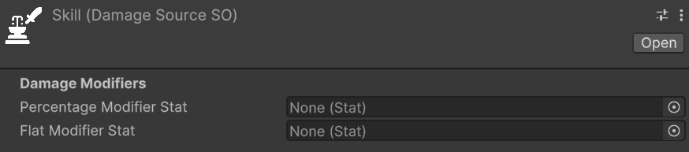
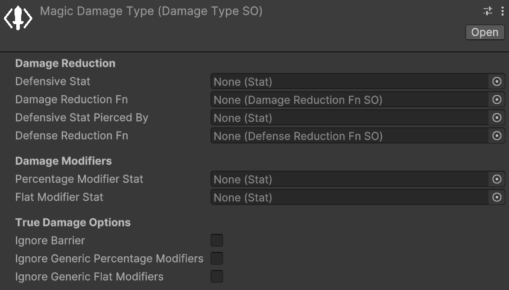
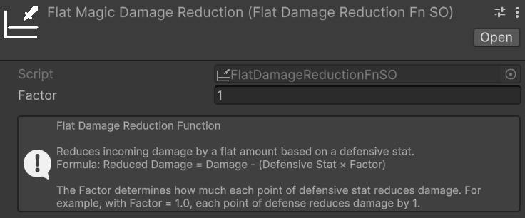
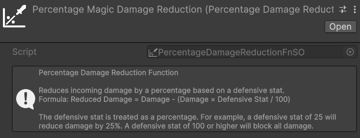
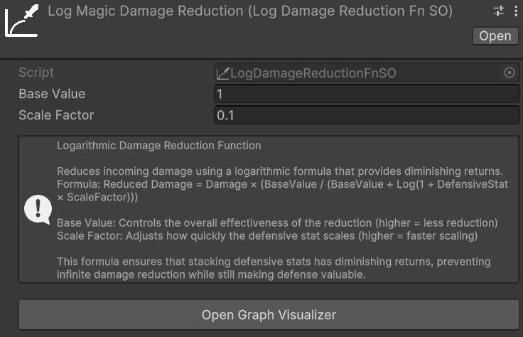
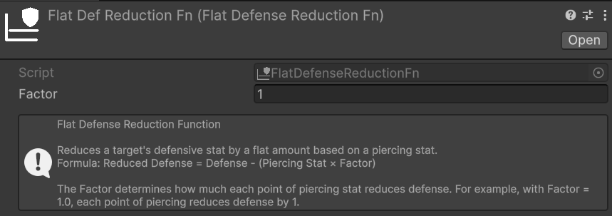
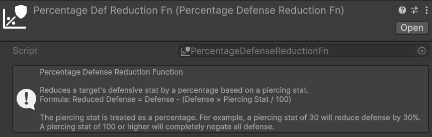
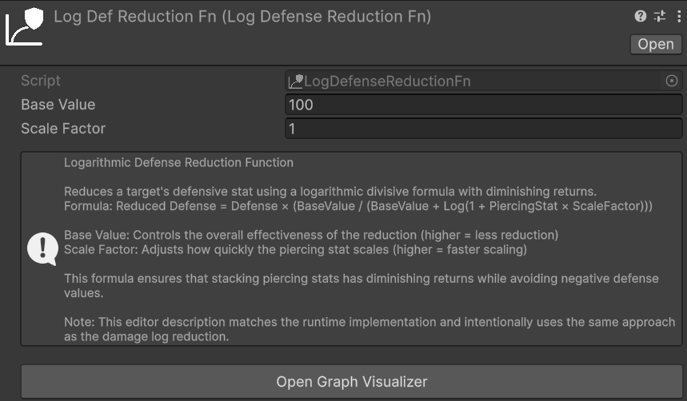

# Damage

## Damage Sources
*Relative path:* `Damage Source`  
A `DamageSource` represents the source of the damage. Some examples of `DamageSource` could be: skill, base attack, fall damage, trap, environmental, etc. The `DamageSource` is used to categorize the damage and can be used in various mechanics, such as damage modifiers that only apply to specific damage sources, for triggering specific effects when taking damage from a certain source, or for tracking damage statistics based on the source.

An instance of `DamageSource`, in the inspector, should look like this:  


There are two properties to set in a `DamageSource`:
- **Percentage Modifier Stat**: the statistic to consider in an entity to apply percentage, specific damage modifiers for this damage source. Positive values of this statistic increase the damage received from this source, while negative values decrease it.
- **Flat Modifier Stat**: the statistic to consider in an entity to apply flat, specific damage modifiers for this damage source. Positive values of this statistic increase the damage received from this source, while negative values decrease it.

> [!WARNING]
> If the entity lacks a percentage or flat damage source modifier statistic, an error will be logged when applying damage from that source. Ensure all entities with an `EntityHealth` component have the statistics referenced in your game's `DamageSource`s.

A possible way to simplify the management of all the `DamageSource` modifier stats is to create a `StatSet` specifically for this purpose, and include it as a _Included Stat Set_ in the various entities' `StatSet`s of your game. This way, you centralize all the `DamageSource` modifier stats in a single `StatSet`, and you can easily keep track of them and ensure that they are included in all the relevant entities.

## Damage Types

A `DamageType` represents the type of damage—such as physical, fire, ice, lightning, or damage-over-time (DoT) effects like bleeding. In the following image you cane see an example of a `DamageType` instance in the inspector:  


You can notice that the parameters are divided in three sections:
1. **Damage Reduction**: parameters related to the damage and defense reduction mechanics for this damage type.
2. **Damage Modifiers**: parameters related to flat and percentage damage modifiers for this damage type.
3. **True Damage Options**: parameters related to the true damage options for this damage type.

> [!NOTE]
> I recall the [Damage Modifiers vs. Stat-Based Damage Reduction](../introduction.md#damage-modifiers-vs-stat-based-damage-reduction) section of the introduction documentation, where I explained the difference between damage reduction and damage modifiers.

We will now see each of these sections in detail.

### Damage Reduction
The primary use case for `DamageType` is implementing entities with varying resistances to specific damage types. This is primarily achieved via **Defensive Stats**.
For each `DamageType`, you can define a defensive statistic that reduces incoming damage of that type. For example, an `Armor` stat might reduce `Physical` damage, while a `Magic Resistance` stat reduces `Magic` damage.  
The value of the defensive stat is fed into the associated **Damage Reduction Fn** (function) and used to calculate the actual damage reduction. The package provides some built-in damage reduction functions, such as:
- **Flat Dmg Reduction**: Reduces damage by a flat amount equal to the defensive stat value multiplied by a constant.
- **Percent Dmg Reduction**: Reduces damage by a percentage equal to the defensive stat value.
- **Log Dmg Reduction**: Reduces damage in a logarithmic way based on the defensive stat value, providing diminishing returns as the stat increases.

> [!NOTE]
> **Defensive Stat** and **Damage Reduction Fn** are optional. However, they must always be configured together: if one is set, the other must be set as well. If only one of them is assigned, a warning will be logged at runtime and the damage reduction step will be skipped for that `DamageType`.

> [!WARNING]
> If the target entity lacks the statistic referenced by **Defensive Stat**, an error will be logged when applying damage of that type. Ensure that all entities with an `EntityHealth` component have the defensive statistic referenced by the `DamageType`s used in your game.

Let's see all of them in detail.

#### Damage Reduction Functions - Flat Dmg Reduction
*Relative path:* `Dmg Reduction Functions -> Flat Dmg Reduction`  

  
The flat damage reduction function is the most simple and straightforward one. It reduces damage by a flat amount equal to the defensive stat value multiplied by the **Factor** specified via the Inspector.  

For example:
- **Damage Type**: Magic damage.
- **Defensive Stat for the Magic Damage Type**: Magic Resistance.
- **Damage Reduction Function for the Magic Damage Type**: Flat Dmg Reduction with a scaling factor of 2.

In this case, if an entity has Magic Resistance equal to 10, and is about to take 50 Magic damage, the damage reduction will be equal to 10 (Magic Resistance) * 2 (scaling factor) = 20. So the final damage taken by the entity will be 50 (initial damage) - 20 (damage reduction) = 30 Magic damage. Clearly, this example assumes that there are no other damage modifications (e.g., neutral damage modifiers).

**Use Cases**:
This function is best suited for games where offensive and defensive stat values are low — close to single digits or tens at most. In these scenarios, the linear relationship between the defensive stat and the damage reduction makes it trivial to ensure that no entity can completely negate incoming damage, as long as the stat values remain within a controlled range. Percentage or logarithmic reduction functions may yield imprecise or unintuitive results at such coarse-grained stat scales.

**Pros**:
- Damage reduction is highly predictable: knowing the defensive stat value and the factor, anyone can instantly calculate the resulting reduction.
- Simple to debug: the math is entirely transparent, making it straightforward to verify that the damage pipeline is working as expected at every step.
- Easy to balance: the linear relationship between the stat and the reduction makes it trivial to tune the factor to achieve the desired game feel.

**Cons**:
- Simplistic system: this function may not suit games that require nuanced or complex defensive mechanics.
- Risk of complete damage negation: if defensive stat values grow too high relative to typical damage values, entities can become entirely immune to certain damage types. This can happen, for example, if the level difference between attacker and defender is too high.

#### Damage Reduction Functions - Percent Dmg Reduction
*Relative path:* `Dmg Reduction Functions -> Percentage Dmg Reduction`  

  
The percentage damage reduction function reduces incoming damage by a percentage equal to the defensive stat value. For example, if an entity has a defensive stat of 30, it will receive 30% less damage of the associated type.

**Use Cases**:
- Games where players can face enemies with notable level or power differences. Because the reduction is percentage-based, even a low-level entity with a small but non-zero defensive stat will always receive a proportional reduction, preventing extreme damage scenarios that would arise from large stat disparities between the attacker and the defender.
- Systems that need to be less sensitive than the Flat Dmg Reduction to the exact magnitude of offensive and defensive stats, while still remaining predictable and easy to balance.

**Pros**:
- Predictable and straightforward to reason about: a stat value of X directly translates to X% less damage.
- Remains effective regardless of the magnitude of incoming damage: even against a significantly stronger attacker, the same proportional reduction applies, guaranteeing that defense always has a meaningful impact.

**Cons**:
- High risk of damage immunity at extreme values: once the defensive stat reaches 100, the entity becomes completely immune to that damage type. This can be especially problematic for tank-oriented entities or builds designed to stack defensive stats.
- Can make late-game balancing challenging if stat values are not tightly bounded.

#### Damage Reduction Functions - Log Dmg Reduction
*Relative path:* `Dmg Reduction Functions -> Log Dmg Reduction`  

  
The logarithmic damage reduction function reduces damage using a logarithmic curve, providing diminishing returns as the defensive stat value increases. A small initial investment in the defensive stat yields a substantial reduction, while further investment produces progressively smaller gains. This makes it theoretically impossible to reach 100% reduction regardless of how high the stat grows.

**Use Cases**:
- RPGs with wide stat ranges and long progression curves — for example, games with levels 1 through 100 or beyond — where both offensive and defensive stats grow substantially over time. The diminishing returns ensure that no entity can become completely immune to a damage type simply by stacking the defensive stat.
- Games where investing in defense should always be viable, but never dominant: players are rewarded for defensive investment, yet the diminishing returns naturally discourage over-specialization and keep combat meaningful at all stages.
- Projects that need a self-capping damage reduction formula without enforcing a hard maximum: the logarithmic curve naturally prevents extreme values from causing damage immunity, reducing the need for manual clamping or caps in the game design.

**Pros**:
- Inherently prevents complete damage immunity: the logarithmic curve approaches but never actually reaches 100% reduction, no matter how high the defensive stat grows.
- Scales gracefully across wide stat ranges, remaining meaningful at every stage of the game without requiring constant rebalancing.
- Discourages over-specialization in defense: the diminishing returns act as a natural soft cap, making it progressively less efficient to stack defensive stats beyond a certain point.

**Cons**:
- Less intuitive than flat or percentage reduction: players and designers cannot easily predict the exact damage reduction for a given stat value at a glance — the log graph window tool is typically needed.
- More complex to debug and tune: the non-linear relationship between the stat and the reduction requires more careful analysis and testing during development.

#### Damage Reduction Functions - Custom Dmg Reduction Functions
If you want to provide your own custom damage reduction function, you can create a new class that inherits from [DamageReductionFnSO](xref:ElctricDrill.AstraRpgHealth.DamageReductionFunctions.DamageReductionFnSO) and implement the `CalculateReducedDamage` method. Remember to use the `CreateAssetMenu` attribute (or the `MenuItem` attribute) to make it creatable from the Unity editor.  
You can take a look at the existing damage reduction functions implementations for reference.

#### Defense Penetration

Defense penetration allows the damage dealer to partially bypass the target's defensive stat before damage reduction is calculated. This mechanism is useful for implementing mechanics such as armor penetration or magic penetration, where an attacker can reduce the effective defenses of the target.

Two optional parameters of the `DamageType` control this behavior:
- **Defensive Stat Pierced By**: the statistic on the **damage dealer** that pierces the target's defensive stat. For example, an `Armor Penetration` stat might pierce the `Armor` stat of the target.
- **Defense Reduction Fn**: the function that computes how the piercing stat lowers the target's defensive stat. The resulting reduced defensive stat value is then passed to the **Damage Reduction Fn** in place of the original value.

> [!NOTE]
> **Defensive Stat Pierced By** and **Defense Reduction Fn** are optional. However, they must always be configured together: if one is set, the other must be set as well. If only one of them is assigned, a warning will be logged at runtime and the defense penetration step will be skipped for that `DamageType`.

> [!WARNING]
> If the damage dealer entity lacks the statistic referenced by **Defensive Stat Pierced By**, an error will be logged when applying damage of that type. Ensure that all entities capable of dealing damage of this type have the relevant piercing statistic.

To illustrate how defense penetration interacts with the rest of the damage pipeline, consider the following example:
- **Damage Type**: Physical damage.
- **Defensive Stat for the Physical Damage Type**: Armor.
- **Damage Reduction Function for the Physical Damage Type**: Flat Dmg Reduction with a factor of 1.
- **Defensive Stat Pierced By**: Armor Penetration.
- **Defense Reduction Fn**: Flat Def Reduction with a factor of 1.

In this case, if the target has Armor equal to 30 and the attacker has Armor Penetration equal to 10, the effective Armor value fed into the Damage Reduction Fn will be 30 (Armor) − 10 (Armor Penetration) × 1 (factor) = 20. So, if the incoming damage is 80, the final damage taken will be 80 − 20 (effective Armor) = 60 Physical damage. This example assumes no other damage modifications are active.

The package provides three built-in Defense Reduction Functions — Flat, Percentage, and Logarithmic — that work in a fully analogous way to their counterparts described in the [Damage Reduction](#damage-reduction) section above. The parameters, trade-offs, and use cases of each variant are the same; the only difference is that these functions operate on the **defensive stat value** rather than directly on the damage amount. For a detailed description of each, refer to the [Damage Reduction](#damage-reduction) section.

*Relative path:* `Def Reduction Functions -> Flat Def Reduction`  


*Relative path:* `Def Reduction Functions -> Percentage Def Reduction`  


*Relative path:* `Def Reduction Functions -> Log Def Reduction`  


If none of the built-in Defense Reduction Functions suits your needs, you can implement a custom one by creating a class that inherits from [DefenseReductionFnSO](xref:ElectricDrill.AstraRpgHealth.DefenseReductionFunctions.DefenseReductionFnSO) and implementing the `CalculateReducedDefense` method. As with the Damage Reduction Functions, remember to use the `CreateAssetMenu` attribute (or the `MenuItem` attribute) to make it creatable from the Unity editor.

### Damage Modifiers

### True Damage Options

## Damage Calculation Pipeline

### PreDamageContext and DamageResolutionContext

### Damage Step

### Damage Calculation Strategy

## Dealing Damage to an Entity

The API method you will use the most with this package is certainly `TakeDamage`, whose responsibility is to apply damage to the entity, taking into account modifiers, immunity, the damage calculation strategy, and other relevant mechanics. This method takes a `PreDamageContext` as input.

The recommended way via code to inflict damage on an entity is as follows:
1. Construct an instance of `PreDamageContext` with all relevant information about the damage you intend to inflict through its fluent builder.
2. Call `TakeDamage` passing the newly constructed context.

Suppose we are implementing a skill that deals 50 fire damage to the target. The code to apply damage to the target could be the following:

```csharp
// Assuming that:
// - dmgType is a DamageType representing fire damage
// - dmgSource is a DamageSource representing the damage coming from a skill
// - target is the EntityCore that we want to damage
// - skillCaster is the EntityCore that casts the skill

// first we ensure that the target has an EntityHealth component
if (target.TryGetComponent(out EntityHealth targetHealth)) {
    // then we build the PreDamageContext with all the relevant information
    var preDamageContext = PreDamageContext.Builder
            .WithAmount(50)
            .WithType(dmgType)
            .WithSource(dmgSource)
            .WithTarget(target)
            .WithDealer(skillCaster)
            .Build();

    // finally, we call TakeDamage to apply the damage to the target
    targetHealth.TakeDamage(preDamageContext);
}
```

Thanks to the `PreDamageContext` fluent builder, the IDE will automatically suggest the fields to fill in one at a time. As long as it presents them one at a time, it means they are required fields. If instead it presents more than one at a time, it means those fields are optional, and you can decide whether to fill them in or build the context without them. Optional fields are, for example, the critical hit flag and the critical multiplier. In the example, for simplicity, I did not fill in these fields.

Now, we know that hardcoding the damage value directly in the code is not a good practice. Let's see how to use a `ScalingFormula` to dynamically calculate the amount of damage to inflict. The step builder creation would become the following:
```csharp
// Assuming that scalingFormula is a ScalingFormula that calculates the damage amount based on the skill caster's stats...

// ...we calculate the damage amount by evaluating the scaling formula
long damageAmount = scalingFormula.CalculateValue(skillCaster);
var preDamageContext = PreDamageContext.Builder
        .WithAmount(damageAmount)
        .WithType(dmgType)
        .WithSource(dmgSource)
        .WithTarget(target)
        .WithDealer(skillCaster)
        .Build();
```
