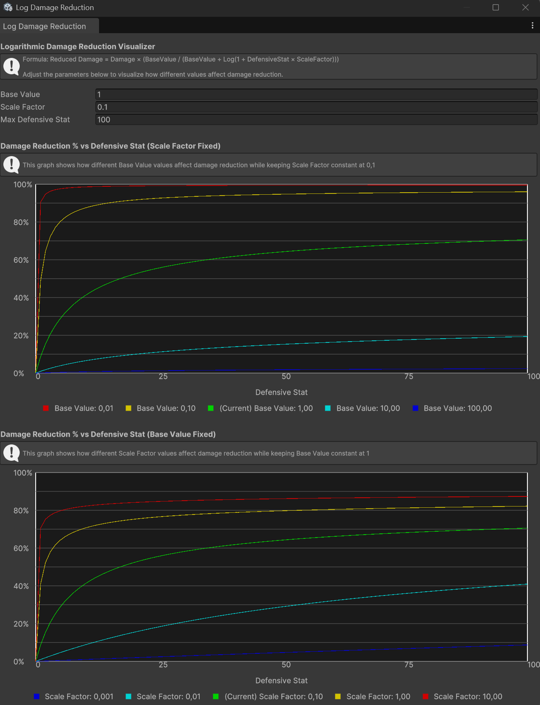
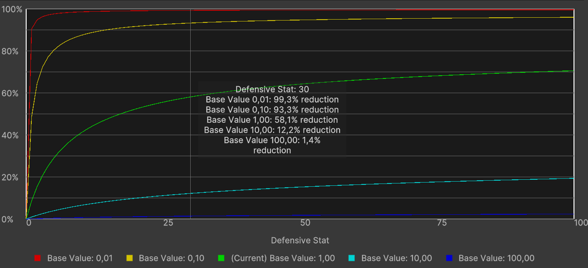
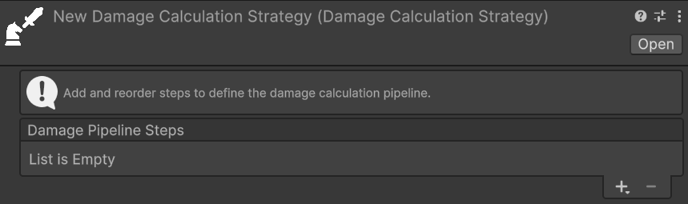
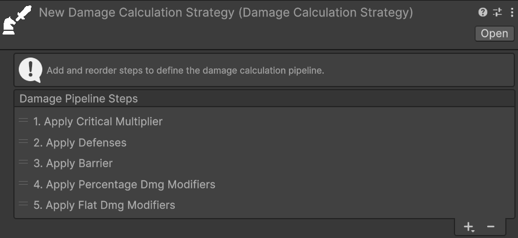

# Damage

## Damage Sources
*Relative path:* `Damage Source`  
A `DamageSourceSO` represents the source of the damage. Some examples of `DamageSourceSO` could be: skill, base attack, fall damage, trap, environmental, etc. The `DamageSourceSO` is used to categorize the damage and can be used in various mechanics, such as damage modifiers that only apply to specific damage sources, for triggering specific effects when taking damage from a certain source, or for tracking damage statistics based on the source.

An instance of `DamageSourceSO`, in the inspector, should look like this:  


### Damage Sources - Modifiers

There are two properties to set in a `DamageSourceSO`:
- **Percentage Modifier Stat**: the statistic to consider in an entity to apply percentage, specific damage modifiers for this damage source. Positive values of this statistic increase the damage received from this source, while negative values decrease it.
- **Flat Modifier Stat**: the statistic to consider in an entity to apply flat, specific damage modifiers for this damage source. Positive values of this statistic increase the damage received from this source, while negative values decrease it.

> [!WARNING]
> If the entity lacks a percentage or flat damage source modifier statistic, an error will be logged when applying damage from that source. Ensure all entities with an `EntityHealth` component have the statistics referenced in your game's `DamageSourceSO`s.

A possible way to simplify the management of all the `DamageSourceSO` modifier stats is to create a `StatSet` specifically for this purpose, and include it as a _Included Stat Set_ in the various entities' `StatSet`s of your game. This way, you centralize all the `DamageSourceSO` modifier stats in a single `StatSet`, and you can easily keep track of them and ensure that they are included in all the relevant entities.

## Damage Types

A `DamageTypeSO` represents the type of damage—such as physical, fire, ice, lightning, or damage-over-time (DoT) effects like bleeding. In the following image you cane see an example of a `DamageTypeSO` instance in the inspector:  


You can notice that the parameters are divided in three sections:
1. **Damage Reduction**: parameters related to the damage and defense reduction mechanics for this damage type.
2. **Damage Modifiers**: parameters related to flat and percentage damage modifiers for this damage type.
3. **True Damage Options**: parameters related to the true damage options for this damage type.

> [!NOTE]
> I recall the [Damage Modifiers vs. Stat-Based Damage Reduction](../introduction.md#damage-modifiers-vs-defensive-stat-based-damage-reduction) section of the introduction documentation, where I explained the difference between damage reduction and damage modifiers.

We will now see each of these sections in detail.

### Damage Reduction
The primary use case for `DamageTypeSO` is implementing entities with varying resistances to specific damage types. This is primarily achieved via **Defensive Stats**.
For each `DamageTypeSO`, you can define a defensive statistic that reduces incoming damage of that type. For example, an `Armor` stat might reduce `Physical` damage, while a `Magic Resistance` stat reduces `Magic` damage.  
The value of the defensive stat is fed into the associated **Damage Reduction Fn** (function) and used to calculate the actual damage reduction. The package provides some built-in damage reduction functions, such as:
- **Flat Dmg Reduction**: Reduces damage by a flat amount equal to the defensive stat value multiplied by a constant.
- **Percent Dmg Reduction**: Reduces damage by a percentage equal to the defensive stat value.
- **Log Dmg Reduction**: Reduces damage in a logarithmic way based on the defensive stat value, providing diminishing returns as the stat increases.

> [!NOTE]
> **Defensive Stat** and **Damage Reduction Fn** are optional. However, they must always be configured together: if one is set, the other must be set as well. If only one of them is assigned, a warning will be logged at runtime and the damage reduction step will be skipped for that `DamageTypeSO`.

> [!WARNING]
> If the target entity lacks the statistic referenced by **Defensive Stat**, an error will be logged when applying damage of that type. Ensure that all entities with an `EntityHealth` component have the defensive statistic referenced by the `DamageTypeSO`s used in your game.

Let's see all of them in detail.

#### Damage Reduction Functions - Flat Dmg Reduction
*Relative path:* `Dmg Reduction Functions -> Flat Dmg Reduction`  

  
The flat damage reduction function is the most simple and straightforward one. It reduces damage by a flat amount equal to the defensive stat value multiplied by the **Factor** specified via the Inspector.  

For example:
- **Damage Type**: Magic damage.
- **Defensive Stat for the Magic Damage Type**: Magic Resistance.
- **Damage Reduction Function for the Magic Damage Type**: Flat Dmg Reduction with a scaling factor of 2.

In this case, if an entity has Magic Resistance equal to 10, and is about to take 50 Magic damage, the damage reduction will be equal to 10 (Magic Resistance) * 2 (scaling factor) = 20. So the final damage taken by the entity will be 50 (initial damage) - 20 (damage reduction) = 30 Magic damage. Clearly, this example assumes that there are no other damage modifications (e.g., neutral damage modifiers).

**Use Cases**:
This function is best suited for games where offensive and defensive stat values are low — close to single digits or tens at most. In these scenarios, the linear relationship between the defensive stat and the damage reduction makes it trivial to ensure that no entity can completely negate incoming damage, as long as the stat values remain within a controlled range. Percentage or logarithmic reduction functions may yield imprecise or unintuitive results at such coarse-grained stat scales.

**Pros**:
- Damage reduction is highly predictable: knowing the defensive stat value and the factor, anyone can instantly calculate the resulting reduction.
- Simple to debug: the math is entirely transparent, making it straightforward to verify that the damage pipeline is working as expected at every step.
- Easy to balance: the linear relationship between the stat and the reduction makes it trivial to tune the factor to achieve the desired game feel.

**Cons**:
- Simplistic system: this function may not suit games that require nuanced or complex defensive mechanics.
- Risk of complete damage negation: if defensive stat values grow too high relative to typical damage values, entities can become entirely immune to certain damage types. This can happen, for example, if the level difference between attacker and defender is too high.

#### Damage Reduction Functions - Percent Dmg Reduction
*Relative path:* `Dmg Reduction Functions -> Percentage Dmg Reduction`  

  
The percentage damage reduction function reduces incoming damage by a percentage equal to the defensive stat value. For example, if an entity has a defensive stat of 30, it will receive 30% less damage of the associated type.

**Use Cases**:
- Games where players can face enemies with notable level or power differences. Because the reduction is percentage-based, even a low-level entity with a small but non-zero defensive stat will always receive a proportional reduction, preventing extreme damage scenarios that would arise from large stat disparities between the attacker and the defender.
- Systems that need to be less sensitive than the Flat Dmg Reduction to the exact magnitude of offensive and defensive stats, while still remaining predictable and easy to balance.

**Pros**:
- Predictable and straightforward to reason about: a stat value of X directly translates to X% less damage.
- Remains effective regardless of the magnitude of incoming damage: even against a significantly stronger attacker, the same proportional reduction applies, guaranteeing that defense always has a meaningful impact.

**Cons**:
- High risk of damage immunity at extreme values: once the defensive stat reaches 100, the entity becomes completely immune to that damage type. This can be especially problematic for tank-oriented entities or builds designed to stack defensive stats.
- Can make late-game balancing challenging if stat values are not tightly bounded.

#### Damage Reduction Functions - Log Dmg Reduction
*Relative path:* `Dmg Reduction Functions -> Log Dmg Reduction`  

  
The logarithmic damage reduction function reduces damage using a logarithmic curve, providing diminishing returns as the defensive stat value increases. A small initial investment in the defensive stat yields a substantial reduction, while further investment produces progressively smaller gains. This makes it theoretically impossible to reach 100% reduction regardless of how high the stat grows.

**The Formula**  
The logarithmic damage reduction function applies the following formula to compute the final damage taken:

```
Reduced Damage = Damage × (BaseValue / (BaseValue + Log(1 + DefensiveStat × ScaleFactor)))
```

Two parameters, configurable directly on the `Log Dmg Reduction` asset, control the shape of the curve:
- **Base Value**: the constant in the denominator of the reduction multiplier. A larger Base Value reduces the relative weight of the logarithmic term, making the reduction curve less aggressive — the same defensive stat value will produce less damage reduction. Conversely, a smaller Base Value amplifies the effect of the logarithm, yielding stronger reductions even at lower stat values.
- **Scale Factor**: the multiplier applied to the defensive stat value before computing the logarithm. A larger Scale Factor causes the curve to climb more steeply at low stat values, reaching substantial reductions earlier. A smaller Scale Factor stretches the curve, requiring higher stat values to achieve the same reduction.

Both parameters must be set to strictly positive values.

**Log Damage Reduction Graph**  
Because the non-linear nature of the formula makes it difficult to reason about the effect of Base Value and Scale Factor at a glance, the package includes a dedicated visualization window. You can open it in two ways:
- Clicking the **Open Graph Visualizer** button in the inspector of any `Log Dmg Reduction` asset.
- From the Unity menu: `Window → Astra RPG Health → Log Damage Reduction Graph`.

The graph visualizer window should look like this:


Once the window is open, three fields let you configure the visualization:
- **Base Value**: the reference Base Value to analyze, matching the value you have set on your asset.
- **Scale Factor**: the reference Scale Factor to analyze, matching the value you have set on your asset.
- **Max Defensive Stat**: the upper bound of the X-axis, i.e., the maximum defensive stat value to plot.

The window displays two separate graphs, each plotting **Damage Reduction %** on the Y-axis and the **Defensive Stat value** on the X-axis:

1. **Scale Factor fixed, Base Value varying** — shows five curves corresponding to different Base Values centered around the reference value you configured, while Scale Factor is held constant. This lets you compare how increasing or decreasing Base Value shifts the reduction curve, making it easier to find a value that achieves the desired behavior for your game's stat range.

2. **Base Value fixed, Scale Factor varying** — shows five curves corresponding to different Scale Factors centered around the reference value, while Base Value is held constant. This lets you compare how Scale Factor affects the steepness of the initial climb of the curve.

In both graphs the legend labels each curve with its exact parameter value, and the middle curve (marked *Current*) corresponds to the reference value you entered. Hovering the mouse over either graph shows a tooltip with the exact damage reduction percentage produced by each curve for the defensive stat value under the cursor, like this:


**Use Cases**:
- RPGs with wide stat ranges and long progression curves — for example, games with levels 1 through 100 or beyond — where both offensive and defensive stats grow substantially over time. The diminishing returns ensure that no entity can become completely immune to a damage type simply by stacking the defensive stat.
- Games where investing in defense should always be viable, but never dominant: players are rewarded for defensive investment, yet the diminishing returns naturally discourage over-specialization and keep combat meaningful at all stages.
- Projects that need a self-capping damage reduction formula without enforcing a hard maximum: the logarithmic curve naturally prevents extreme values from causing damage immunity, reducing the need for manual clamping or caps in the game design.

**Pros**:
- Inherently prevents complete damage immunity: the logarithmic curve approaches but never actually reaches 100% reduction, no matter how high the defensive stat grows.
- Scales gracefully across wide stat ranges, remaining meaningful at every stage of the game without requiring constant rebalancing.
- Discourages over-specialization in defense: the diminishing returns act as a natural soft cap, making it progressively less efficient to stack defensive stats beyond a certain point.

**Cons**:
- Less intuitive than flat or percentage reduction: players and designers cannot easily predict the exact damage reduction for a given stat value at a glance — the log graph window tool is typically needed.
- More complex to debug and tune: the non-linear relationship between the stat and the reduction requires more careful analysis and testing during development.

#### Damage Reduction Functions - Custom Dmg Reduction Functions
If you want to provide your own custom damage reduction function, you can create a new class that inherits from [DamageReductionFnSO](xref:ElectricDrill.AstraRpgHealth.DamageReductionFunctions.DamageReductionFnSO) and implement the `CalculateReducedDamage` method. Remember to use the `CreateAssetMenu` attribute (or the `MenuItem` attribute) to make it creatable from the Unity editor.  
You can take a look at the existing damage reduction functions implementations for reference.

#### Defense Penetration

Defense penetration allows the damage dealer to partially bypass the target's defensive stat before damage reduction is calculated. This mechanism is useful for implementing mechanics such as armor penetration or magic penetration, where an attacker can reduce the effective defenses of the target.

Two optional parameters of the `DamageTypeSO` control this behavior:
- **Defensive Stat Pierced By**: the statistic on the **damage dealer** that pierces the target's defensive stat. For example, an `Armor Penetration` stat might pierce the `Armor` stat of the target.
- **Defense Reduction Fn**: the function that computes how the piercing stat lowers the target's defensive stat. The resulting reduced defensive stat value is then passed to the **Damage Reduction Fn** in place of the original value.

> [!NOTE]
> **Defensive Stat Pierced By** and **Defense Reduction Fn** are optional. However, they must always be configured together: if one is set, the other must be set as well. If only one of them is assigned, a warning will be logged at runtime and the defense penetration step will be skipped for that `DamageTypeSO`.

> [!WARNING]
> If the damage dealer entity lacks the statistic referenced by **Defensive Stat Pierced By**, an error will be logged when applying damage of that type. Ensure that all entities capable of dealing damage of this type have the relevant piercing statistic.

To illustrate how defense penetration interacts with the rest of the damage pipeline, consider the following example:
- **Damage Type**: Physical damage.
- **Defensive Stat for the Physical Damage Type**: Armor.
- **Damage Reduction Function for the Physical Damage Type**: Flat Dmg Reduction with a factor of 1.
- **Defensive Stat Pierced By**: Armor Penetration.
- **Defense Reduction Fn**: Flat Def Reduction with a factor of 1.

In this case, if the target has Armor equal to 30 and the attacker has Armor Penetration equal to 10, the effective Armor value fed into the Damage Reduction Fn will be 30 (Armor) − 10 (Armor Penetration) × 1 (factor) = 20. So, if the incoming damage is 80, the final damage taken will be 80 − 20 (effective Armor) = 60 Physical damage. This example assumes no other damage modifications are active.

The package provides three built-in Defense Reduction Functions — Flat, Percentage, and Logarithmic — that work in a fully analogous way to their counterparts described in the [Damage Reduction](#damage-reduction) section above. The parameters, trade-offs, and use cases of each variant are the same; the only difference is that these functions operate on the **defensive stat value** rather than directly on the damage amount. For a detailed description of each, refer to the [Damage Reduction](#damage-reduction) section.

*Relative path:* `Def Reduction Functions -> Flat Def Reduction`  


*Relative path:* `Def Reduction Functions -> Percentage Def Reduction`  


*Relative path:* `Def Reduction Functions -> Log Def Reduction`  


If none of the built-in Defense Reduction Functions suits your needs, you can implement a custom one by creating a class that inherits from [DefenseReductionFnSO](xref:ElectricDrill.AstraRpgHealth.DefenseReductionFunctions.DefenseReductionFnSO) and implementing the `CalculateReducedDefense` method. As with the Damage Reduction Functions, remember to use the `CreateAssetMenu` attribute (or the `MenuItem` attribute) to make it creatable from the Unity editor.

### Damage Types - Damage Modifiers

The **Percentage Modifier Stat** and **Flat Modifier Stat** fields in this section let you assign stat-based damage modifiers that apply specifically when an entity receives damage of this `DamageTypeSO`. Assigning a positive value to either stat increases the damage received from this type; a negative value decreases it. For a full explanation of how all damage modifier categories work and how they stack together, see the [Damage Modifiers](#damage-modifiers) section.

A possible way to simplify the management of all the `DamageTypeSO` modifier stats is to create a `StatSet` specifically for this purpose, and include it as a _Included Stat Set_ in the various entities' `StatSet`s of your game. This way, you centralize all the `DamageTypeSO` modifier stats in a single `StatSet`, and you can easily keep track of them and ensure that they are included in all the relevant entities.

### True Damage Options

The **True Damage Options** section of a `DamageTypeSO` exposes three boolean flags that allow selective bypasses for individual stages of the damage pipeline. They are the primary tool for implementing "true damage" mechanics — damage that partially or entirely skips specific mitigation layers — without requiring a custom `DamageCalculationStrategy`.

- **Ignore Barrier**: when enabled, the [`ApplyBarrierStep`](#damage-step) is skipped entirely for this `DamageTypeSO`. Damage bypasses the target's barrier and is applied directly to its health pool. Use this for damage types that are meant to be unavoidable through shielding — for example, a pure true damage type, fall damage, or damage-over-time effects that should not interact with temporary shields.

- **Ignore Generic Percentage Modifiers**: when enabled, the [`ApplyPercentageDmgModifiersStep`](#damage-step) skips the **Generic Percentage Damage Modification Stat** configured in `AstraRpgHealthConfigSO`. Percentage modifiers from the `DamageSourceSO` or from this `DamageTypeSO` itself still apply normally.

- **Ignore Generic Flat Modifiers**: when enabled, the [`ApplyFlatDmgModifiersStep`](#damage-step) skips the **Generic Flat Damage Modification Stat** configured in `AstraRpgHealthConfigSO`. Flat modifiers from the `DamageSourceSO` or from this `DamageTypeSO` itself still apply normally.

> [!IMPORTANT]
> **Ignore Generic Percentage Modifiers** and **Ignore Generic Flat Modifiers** bypass only the _generic_ modifier layer — the global stats configured in `AstraRpgHealthConfigSO`. Source-specific and type-specific modifier stats are never bypassed by these flags and always participate in the pipeline normally.
>
> However, if a `DamageSourceSO` or this `DamageTypeSO` has no modifier stats assigned, those layers contribute nothing by construction — which effectively produces the same result as a bypass. Enabling all three flags while also leaving all modifier stats unset on the source and type produces a fully modifier-free damage type.

> [!TIP]
> To create a damage type that is also unaffected by any defensive stat, simply leave **Defensive Stat** and **Damage Reduction Fn** empty. The [`ApplyDefenseStep`](#damage-step) has nothing to compute and is skipped. Combined with the three True Damage Option flags and no modifier stats, this defines a fully unmitigated damage type.

## Dealing Damage to an Entity

The API method you will use the most with this package is certainly `TakeDamage`, whose responsibility is to apply damage to the entity, taking into account modifiers, immunity, the damage calculation strategy, and other relevant mechanics. This method takes a `PreDamageContext` as input.

The recommended way via code to inflict damage on an entity is as follows:
1. Construct an instance of `PreDamageContext` with all relevant information about the damage you intend to inflict through its fluent builder.
2. Call `TakeDamage` passing the newly constructed context.

Suppose we are implementing a skill that deals 50 fire damage to the target. The code to apply damage to the target could be the following:

```csharp
// Assuming that:
// - dmgType is a DamageType representing fire damage
// - dmgSource is a DamageSource representing the damage coming from a skill
// - target is the EntityCore that we want to damage
// - skillCaster is the EntityCore that casts the skill

// first we ensure that the target has an EntityHealth component
if (target.TryGetComponent(out EntityHealth targetHealth)) {
    // then we build the PreDamageContext with all the relevant information
    var preDamageContext = PreDamageContext.Builder
            .WithAmount(50)
            .WithType(dmgType)
            .WithSource(dmgSource)
            .WithTarget(target)
            .WithDealer(skillCaster)
            .Build();

    // finally, we call TakeDamage to apply the damage to the target
    targetHealth.TakeDamage(preDamageContext);
}
```

Thanks to the `PreDamageContext` fluent builder, the IDE will automatically suggest the fields to fill in one at a time. As long as it presents them one at a time, it means they are required fields. If instead it presents more than one at a time, it means those fields are optional, and you can decide whether to fill them in or build the context without them. Optional fields are, for example, the critical hit flag and the critical multiplier. In the example, for simplicity, I did not fill in these fields.

Now, we know that hardcoding the damage value directly in the code is not a good practice. Let's see how to use a `ScalingFormula` to dynamically calculate the amount of damage to inflict. The step builder creation would become the following:
```csharp
// Assuming that scalingFormula is a ScalingFormula that calculates the damage amount based on the skill caster's stats...

// ...we calculate the damage amount by evaluating the scaling formula
long damageAmount = scalingFormula.CalculateValue(skillCaster);
var preDamageContext = PreDamageContext.Builder
        .WithAmount(damageAmount)
        .WithType(dmgType)
        .WithSource(dmgSource)
        .WithTarget(target)
        .WithDealer(skillCaster)
        .Build();
```


## Damage Modifiers

Damage modifiers are a flexible tool for implementing mechanics such as resistances, weaknesses, buffs, and debuffs that affect how much damage an entity receives. Unlike [Defensive Stat-Based Damage Reduction](../introduction.md#damage-modifiers-vs-defensive-stat-based-damage-reduction), damage modifiers are off by default — their stats default to 0 — and can both increase and decrease the damage amount.

Three categories of damage modifiers exist, and they all stack additively with one another:
- **Generic modifiers**: apply to all damage received by an entity, regardless of damage type or source.
- **DamageSource modifiers**: apply only when the damage originates from a specific `DamageSourceSO`.
- **DamageType modifiers**: apply only when the damage is of a specific `DamageTypeSO`.

### Generic Damage Modifiers
Generic modifiers are configured in the `AstraRpgHealthConfigSO` asset and apply universally to every instance of damage received by an entity. The two relevant fields are **Generic Flat Damage Modification Stat** and **Generic Percentage Damage Modification Stat**, described in detail in the [Package Configuration](./package-configuration.md#generic-flat-damage-modification-stat) page.

As a quick recap:
- **Generic Flat Damage Modification Stat**: a `Stat` whose value is added to (or subtracted from) the incoming damage amount as a flat quantity. A positive value increases the damage received; a negative value decreases it.
- **Generic Percentage Damage Modification Stat**: a `Stat` whose value is applied as a percentage modification to the incoming damage. A value of 20 means +20% more damage received; a value of −20 means −20% less damage received.

### DamageSource Modifiers
As already introduced in the [Damage Sources](#damage-sources) section, each `DamageSourceSO` asset exposes a **Percentage Modifier Stat** and a **Flat Modifier Stat**. These work identically to the generic modifiers described above, but are applied only when the damage originates from that specific `DamageSourceSO`.

### DamageType Modifiers
Similarly, each `DamageTypeSO` asset exposes a **Percentage Modifier Stat** and a **Flat Modifier Stat** in its **Damage Modifiers** inspector section. These work in the same way as the source-specific modifiers, but are applied only when the damage is of that specific `DamageTypeSO`. A typical use case is implementing elemental weaknesses and resistances: for example, a `Fire Weakness` stat could be assigned as the **Percentage Modifier Stat** of a Fire `DamageTypeSO`, so that entities with a positive value of that stat take proportionally more Fire damage.

> [!WARNING]
> As with `DamageSourceSO` modifiers, if the target entity lacks any statistic referenced by the **Percentage Modifier Stat** or **Flat Modifier Stat** fields on a `DamageTypeSO`, an error will be logged when applying damage of that type. Ensure that all entities with an `EntityHealth` component have the damage modifier statistics referenced by the `DamageTypeSO`s used in your game. A practical approach is the same suggested for `DamageSourceSO` modifiers: centralize all modifier stats in a dedicated `StatSet` and include it in the relevant entities' stat sets.

### Stacking Behavior
When the `ApplyFlatDmgModifiersStep` and `ApplyPercentageDmgModifiersStep` steps are included in the active `DamageCalculationStrategy` (that we will see soon in the [Damage Calculation Strategy](#damage-calculation-strategy) section), all applicable modifiers of the same kind are **summed additively** into a single net value, which is then applied to the current damage amount in one operation.

For percentage modifiers, the system also performs individual immunity checks before summing: if the generic percentage modifier alone reaches −100 or below, the damage is fully prevented and the entity is flagged as immune to all damage for that hit; if the source- or type-specific modifier alone reaches −100 or below, the damage is prevented and the entity is flagged as immune to that specific source or type respectively.

## Damage Calculation Pipeline

When you call `TakeDamage` on an `EntityHealth`, the raw damage amount you specify does not reach the entity's health pool directly. Instead, it passes through the **Damage Calculation Pipeline**: an ordered sequence of processing steps, each responsible for one aspect of the calculation — barriers, critical multipliers, modifiers, and defenses. Think of it as a production line: raw damage enters at the first station and is transformed by each step in turn; what exits the last step is what the entity actually loses from its health.

The strength of this design is its configurability. Which steps are active, and in what order, is defined entirely by a `DamageCalculationStrategy` asset that you set up in the Inspector — no scripting required. Different entities can use different strategies: a boss might have its own pipeline featuring an extra final step that limits the incoming damage to a maximum value of 10% of the Max HP, while regular enemies fall back to the project-wide default. Strategies can also be swapped at runtime, enabling mechanics such as temporary invincibility phases or damage rules that change mid-encounter.

Internally, the pipeline runs its steps sequentially on a shared state object and short-circuits the moment damage is marked as prevented: if a barrier fully absorbs the hit, or a modifier grants immunity, all remaining steps are skipped and the result is returned immediately.

### Pipeline Data Types

The pipeline uses a small set of dedicated types to keep concerns cleanly separated — there is one type for what you request, one for what flows through the steps, and one for what you receive back. As a designer integrating `TakeDamage` into your game code, you will interact with two of these directly: `PreDamageContext` to describe the damage you want to apply, and `DamageResolutionContext` to inspect the outcome. The others are managed internally by the pipeline and are primarily relevant if you are implementing custom steps or hooking into damage events for analytics or reactions.

**`PreDamageContext`** is the descriptor you build before calling `TakeDamage`. Its mandatory fields are enforced by a fluent step-builder that requires them in order: amount → type → damage source → target → source/dealer. Optional fields include `IsCritical`, `CriticalMultiplier`, and `Ignore`. Setting `Ignore = true` causes the pipeline to be bypassed entirely; the damage is flagged as prevented with `PrePhaseIgnored` before any calculation begins.

**`DamageInfo`** is the mutable state object that flows through the pipeline. It is constructed from a `PreDamageContext` at the start of `TakeDamage` and holds:
- **`Amounts`** — a `DamageAmountContext` tracking the current damage value and step-by-step history.
- **`Type`**, **`DamageSourceSO`**, **`Target`**, **`Source`**, **`IsCritical`**, **`CriticalMultiplier`** — metadata forwarded from the `PreDamageContext`.
- **`Reasons`** — a `DamagePreventionReason` flags enum accumulating all reasons why damage was prevented.
- **`IsPrevented`** — returns `true` when `Reasons` is not `None`; used to short-circuit the pipeline.

**`DamageAmountContext`** tracks the numerical amount throughout the pipeline:
- **`InitialAmount`** — the original raw value; never modified after construction.
- **`Current`** — the damage value as modified by each step; steps read and write this property.
- **`Records`** — a read-only list of `StepAmountRecord` entries, each capturing the step type and the before/after `Current` values for that step. Useful for debugging and diagnostics.

**`DamageResolutionContext`** is the value returned by `TakeDamage`. It contains:
- **`Outcome`** — `DamageOutcome.Applied` or `DamageOutcome.Prevented`.
- **`Reasons`** — the accumulated `DamagePreventionReason` flags when prevented; `None` when applied.
- **`TerminationStepType`** — the `Type` of the step that caused early termination, if any.
- **`FinalDamageInfo`** — the `DamageInfo` at the end of the pipeline; may be `null` when damage was prevented in the pre-phase.
- **`PreDamageContext`** — the original input that initiated this damage attempt.

**`DamageOutcome`** is a two-value enum: `Applied` (damage was applied to the entity's health or barrier) and `Prevented` (damage was stopped before affecting the entity).

**`DamagePreventionReason`** is a flags enum that accumulates one or more reasons why damage was prevented:

| Value | When set |
|---|---|
| `None` | No prevention; damage can proceed. |
| `EntityImmune` | Target has global immunity (`IsImmune = true` on `EntityHealth`). |
| `AllDamageImmune` | Generic percentage damage reduction stat alone reached ≤ −100%. |
| `DamageTypeImmune` | Type-specific percentage modifier alone reached ≤ −100%. |
| `DamageSourceImmune` | Source-specific percentage modifier alone reached ≤ −100%. |
| `BarrierAbsorbed` | Barrier fully absorbed the incoming damage. |
| `DefenseAbsorbed` | Defensive stat computation reduced damage to zero. |
| `PrePhaseIgnored` | `PreDamageContext.Ignore` was `true` before the pipeline started. |
| `PrePhaseZeroAmount` | `PreDamageContext.Amount` was zero or negative. |
| `PipelineReducedToZero` | A step reduced damage to zero without a more specific absorption reason. |
| `EntityDead` | Target was already dead when `TakeDamage` was called. |

> [!NOTE]
> `DamagePreventionReason` is a flags enum: multiple values can be set simultaneously on the same damage attempt. Inspect `DamageResolutionContext.Reasons` to read all accumulated reasons after a call to `TakeDamage`.

### Damage Step

Each station in the pipeline is a `DamageStep` — an independent, composable unit of work that applies one focused transformation to the damage in flight. The five built-in steps cover the most common scenarios out of the box. If your game needs specialised behaviour — for example, a step that clamps the damage to a maximum value of 10% of the Max HP — you can implement a custom step by creating a class that inherits from [`DamageStep`](xref:ElectricDrill.AstraRpgHealth.Damage.CalculationPipeline.DamageStep) and implements `ProcessStep()`.

Step order matters. Each step receives the output of the one before it, so a different arrangement of the same steps produces a different result. Placing a critical multiplier step before defensive steps amplifies the pre-mitigation damage; placing it after scales a lower, post-mitigation value. We will see how to compose and reorder steps from the Inspector in the [Damage Calculation Strategy](#damage-calculation-strategy) section.

`DamageStep` is the abstract base class for all pipeline steps. Each step performs one focused transformation on `DamageInfo`. The pipeline runner calls `Process()` on each step in order; concrete implementations override `ProcessStep()`.

`Process()` enforces two preconditions automatically before delegating to `ProcessStep()`:
- If `DamageInfo.IsPrevented` is `true`, the step is skipped.
- If `DamageInfo.Amounts.Current` is ≤ 0, the step is skipped.

After `ProcessStep()` returns, `Process()` appends a `StepAmountRecord` to `DamageAmountContext.Records` with the before and after amounts. If the step brought a positive amount to zero without setting a more specific prevention reason, `DamagePreventionReason.PipelineReducedToZero` is set automatically.

The package includes five built-in `DamageStep` implementations:

#### ApplyCriticalMultiplierStep

Critical hits deal amplified damage. This step multiplies the current damage amount by the critical hit multiplier when the incoming damage has been flagged as a critical strike. Its position in the pipeline is a design decision: placed before defensive steps, the multiplier scales raw (or modifier-adjusted) damage; placed after, it scales the already-mitigated result. Usually critical multipliers are applied early or as first step.

Scales the current damage by the critical hit multiplier when the damage is flagged as a critical hit. The step reads `DamageInfo.IsCritical` and `DamageInfo.CriticalMultiplier`. It is a no-op if `IsCritical` is `false`, or if the multiplier is ≤ 0 or exactly 1.0.

Both the critical flag and the multiplier are set in the `PreDamageContext` when building the damage request. A multiplier of 2.0 doubles the `Current` amount at the point where this step executes.

> [!NOTE]
> The position of `ApplyCriticalMultiplierStep` in the pipeline determines what value the multiplier is applied to. Placing it before `ApplyDefenseStep` amplifies damage prior to defensive mitigation; placing it after scales post-defense damage. Design your strategy order accordingly.

#### ApplyDefenseStep

This step applies the target entity's defensive stat for this damage type — the primary stat-based mitigation layer in a typical RPG setup. For example, for a Physical damage type with Armor as its **Defensive Stat**, this step reads the target's Armor value, optionally reduces it by any armor penetration, then feeds the result into the **Damage Reduction Fn** to compute the mitigated damage. This is usually the step that eliminates most of the incoming damage for well-armored targets.

Applies defensive stat-based damage reduction as configured in the `DamageTypeSO`. The step reads the **Defensive Stat** and **Damage Reduction Fn**, and optionally the **Defense Penetration Stat** and **Defense Reduction Fn** (see [Defense Penetration](#defense-penetration)).

The step is a no-op when both **Defensive Stat** and **Damage Reduction Fn** are unset — which is the intended configuration for a damage type that should never be mitigated by defenses. If the configuration is inconsistent (one field set, the other null), a warning is logged and the step is skipped. The effective defensive value is computed after applying any penetration reduction, then fed into the **Damage Reduction Fn** to yield the final reduced amount. If the result is ≤ 0, `DamagePreventionReason.DefenseAbsorbed` is set.

#### ApplyBarrierStep

Barriers act as a temporary shield layer in front of an entity's health pool: incoming damage hits the barrier first, and only what the barrier cannot absorb continues on to the next step. This step is the mechanism behind shielding abilities and any temporary protective layer you implement with the barrier system. Its position in the pipeline determines how much barrier is actually consumed: placing it after `ApplyDefenseStep` means the barrier only ever sees damage that already survived defensive mitigation, so the barrier is drained more slowly. Placing it before defensive steps causes the barrier to absorb the full, unreduced hit — making it a purer shield but one that depletes faster.

Consumes the target entity's barrier (temporary shield) to reduce incoming damage before it reaches health. If the `DamageTypeSO` has **Ignore Barrier** enabled, this step is skipped entirely. If the target has no `EntityHealth` component or its barrier is zero, the step is also a no-op.

The step subtracts from `DamageInfo.Amounts.Current` the portion absorbed by the barrier, and reduces the entity's barrier by the same amount. If the barrier fully absorbs the hit, `DamagePreventionReason.BarrierAbsorbed` is set and the pipeline terminates. Damage that exceeds the barrier continues through subsequent steps as the updated `Current` value.

> [!NOTE]
> `ApplyBarrierStep` does not reduce health directly. Any remaining damage after barrier absorption continues through the pipeline and is applied to health at the end of `TakeDamage`.

#### ApplyPercentageDmgModifiersStep

Percentage modifiers scale the incoming damage by a fraction. The three modifier layers (generic, source-specific, type-specific) each correspond to a stat whose value the target entity holds at runtime. A negative value reduces damage, a positive value amplifies it. When a single modifier layer reaches −100% or below on its own, the entity becomes immune to that entire category of damage for this hit.

Applies percentage-based damage modifiers from up to three layers, in order:
1. **Generic** — reads `AstraRpgHealthConfigSO.GenericPercentageDamageModificationStat` from the target's stats. Skipped if the `DamageTypeSO` has **Ignore Generic Percentage Modifiers** enabled.
2. **DamageSource-specific** — reads `DamageSourceSO.PercentageDamageModificationStat` from the target's stats.
3. **DamageType-specific** — reads `DamageTypeSO.PercentageDamageModificationStat` from the target's stats.

Each layer is evaluated individually for full immunity before contributions are summed. If the generic layer alone reaches ≤ −100%, `DamagePreventionReason.AllDamageImmune` is set and the step exits immediately. If the source-specific layer alone reaches ≤ −100%, `DamagePreventionReason.DamageSourceImmune` is set. If the type-specific layer alone reaches ≤ −100%, `DamagePreventionReason.DamageTypeImmune` is set. If no single layer triggers immunity, the three contributions are summed additively into a single net percentage applied to `Current` in one operation.

#### ApplyFlatDmgModifiersStep

Where percentage modifiers scale damage proportionally, flat modifiers add or subtract a fixed amount regardless of the hit's magnitude. A −15 flat absorb always removes 15 damage, whether the incoming hit was 20 or 2000. Flat modifiers are typically placed after percentage modifiers so they adjust the already-scaled value — but you are free to order them as your game design requires.

Applies flat damage modifiers from the same three layers as `ApplyPercentageDmgModifiersStep`:
1. **Generic** — reads `AstraRpgHealthConfigSO.GenericFlatDamageModificationStat`. Skipped if the `DamageTypeSO` has **Ignore Generic Flat Modifiers** enabled.
2. **DamageSource-specific** — reads `DamageSourceSO.FlatDamageModificationStat`.
3. **DamageType-specific** — reads `DamageTypeSO.FlatDamageModificationStat`.

All three contributions are summed additively. The net value is added to or subtracted from `DamageInfo.Amounts.Current`. The result is clamped to a minimum of 0: flat modifiers cannot bring damage below zero.

> [!NOTE]
> The conventional order is to run percentage modifiers before flat modifiers, so that flat additions or reductions are applied to the already-scaled value. This ordering is not enforced by the system; you can arrange steps freely.

### Damage Calculation Strategy

*Relative path:* `Damage Calculation Strategy`

Rather than embedding damage calculation logic in scripts, Astra RPG Health externalises the pipeline into a `DamageCalculationStrategy` asset — a `ScriptableObject` you control entirely from the Inspector. Each strategy holds an ordered list of steps; changing the list changes the pipeline. This separation lets you design, tune, and swap calculation behaviours without touching any code. A boss encounter can use a custom strategy with a specific subset of steps (e.g., one final extra step that limits the incoming damage to a maximum value of 10% of the Max HP); regular enemies fall back to the project-wide default; a runtime debuff can temporarily replace an entity's strategy to alter how it takes damage during a special encounter phase (e.g., all lightning damage is doubled).

In the Inspector, the strategy exposes a reorderable list labelled **Damage Pipeline Steps**. Steps can be added via a type-selection dropdown (the "Step" suffix is trimmed from display names for readability), removed, and reordered via drag. A newly created, empty strategy looks like this:



Once steps are added and arranged, the Inspector shows them as a numbered list reflecting the execution order:



Every `EntityHealth` component resolves the active strategy at runtime through a **three-tier priority**:
1. **Override Damage Calculation Strategy** — takes precedence over all other settings. Intended for temporary runtime effects (e.g., a debuff that temporarily changes how an entity takes damage) or for testing when a custom strategy is already assigned.
2. **Custom Damage Calculation Strategy** — an entity-specific strategy that overrides the global default but can itself be overridden at runtime by the tier above.
3. **Default Damage Calculation Strategy** — configured in `AstraRpgHealthConfigSO` and applied to every entity that defines neither a custom nor an override strategy.

> [!IMPORTANT]
> If no strategy is resolved — neither custom nor override is set on the entity, and no default is configured in `AstraRpgHealthConfigSO` — `TakeDamage` logs an error and the pipeline does not run.