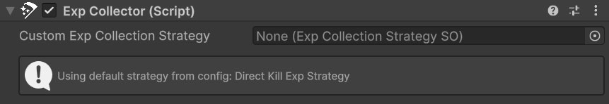
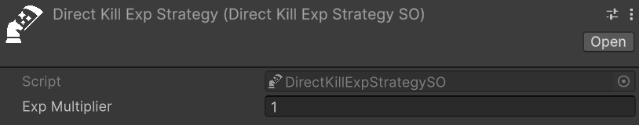
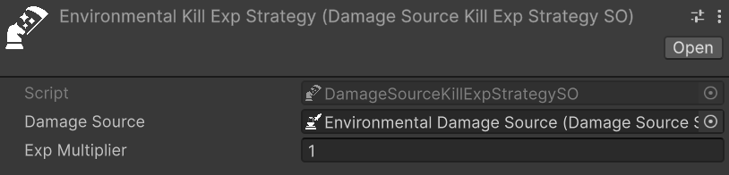
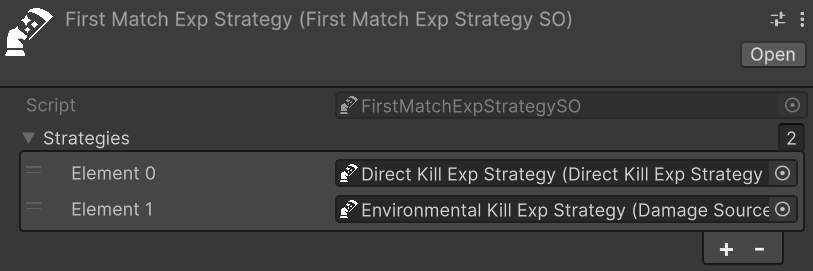

# Experience Collection

_Experience collection_ is the mechanism through which entities earn experience points when they contribute to enemy kills (or entities deaths in general in some cases). In Astra RPG Health, the system revolves around two actors: the _collector_, the entity that receives experience, and the _victim_, the entity that dies and provides it.

When a victim dies, its `EntityHealth` raises a global [EntityDied](entity-health.md#global-events) event. Any `ExpCollector` component listening to that event evaluates its configured strategy to determine whether XP should be awarded — and if so, extracts the XP amount from the victim and forwards it to the collector's `EntityLevel`. The entire validation and collection logic lives inside a dedicated _Experience Collection Strategy_ asset, making it straightforward to swap, extend, or compose strategies without touching any component code.

> [!IMPORTANT]
> Experience collection relies on the global `EntityDied` event being correctly configured on each entity's `EntityHealth`. Without it, `ExpCollector` will never be notified of kills. See [Global Events](entity-health.md#global-events) for the setup details.

## Prerequisites

Before setting up experience collection, ensure the following are in place.

On each **victim** entity:

- **The victim must expose experience through an `ExpSource` component**. The Astra RPG Framework provides a concrete `ExpSource : MonoBehaviour` that stores the XP amount and a harvested flag. Attach this component to any entity that should provide XP when it dies, and configure the amount accordingly. Refer to the Framework documentation for details: https://electricdrill.github.io/AstraRpgFrameworkDocs/MD/workflows.html#exp-source

On the **collector** entity:

- **The collector must be an entity.** Therefore, it must have the `EntityCore` component.

## Setting Up the Exp Collector

`ExpCollector` is the component that bridges the global death event and the configured strategy. Add it to any entity that should receive XP from kills.

Because `ExpCollector` carries `[RequireComponent(typeof(EntityDiedGameEventListener))]`, Unity automatically attaches an `EntityDiedGameEventListener` to the same GameObject when you add `ExpCollector`. This listener is what connects the global `EntityDied` event to the component's logic.

The following image shows the `ExpCollector` inspector:  

<!-- IMAGE MISSING: exp-collector.png — screenshot of the ExpCollector component inspector, showing the Custom Exp Collection Strategy field and the EntityDiedGameEventListener wiring below -->

Once both components are on the GameObject, two things must be wired manually in the inspector:

1. On the `EntityDiedGameEventListener`, assign the **global `EntityDied` game event SO** to its **Event** field. This must be the same event asset that is assigned to each `EntityHealth` in the scene — that is what makes the listener fire when any entity dies.
2. On the **Response** UnityEvent of the `EntityDiedGameEventListener`, add a callback and wire it to `ExpCollector.CheckCollectKillExp`. You should find it under the `Dynamic EntityDiedContext` section of the context menu.

> [!IMPORTANT]
> The event wiring described above is fully manual and must be done in the inspector. An automatic setup will be evaluated for a future release.

**Custom Exp Collection Strategy** is the optional per-entity override. Assign a strategy here to give this specific collector its own behavior — for example, a boss that earns XP only from specific kill types, or a trap system with its own award logic. When left empty, the collector falls back to the project-wide default configured in `AstraRpgHealthConfigSO` (see [Default Strategy in Package Configuration](#default-strategy-in-package-configuration)).

### Inspector Status Box

The custom `ExpCollector` inspector includes a status indicator that shows at a glance whether an active strategy is in place:

- **Info — "Using custom strategy: [name]"**: a **Custom Exp Collection Strategy** is assigned on this component.
- **Info — "Using default strategy from config: [name]"**: no custom strategy is assigned, but a default is found in the `AstraRpgHealthConfigSO`.
- **Warning — "No AstraRpgHealthConfig found…"**: no package configuration asset is in scope. See [Package Configuration](package-configuration.md) for setup details.
- **Warning — "No default experience collection strategy configured in AstraRpgHealthConfig…"**: a configuration asset exists but no **Default Exp Collection Strategy** is set on it.

The following image shows the status box in each of these states:  

<!-- IMAGE MISSING: exp-collector-status.png — screenshot showing the four possible status box states (info: custom, info: default from config, warning: no config, warning: no default) -->

## Default Strategy in Package Configuration

Collectors without a **Custom Exp Collection Strategy** fall back to the **Default Exp Collection Strategy** set in the `AstraRpgHealthConfigSO`. Configuring this field once means every bare `ExpCollector` in the project inherits the same behavior without needing an explicit assignment on each one.

The following image shows the Experience section of the `AstraRpgHealthConfigSO`:  

<!-- IMAGE MISSING: exp-config.png — screenshot of the AstraRpgHealthConfigSO inspector, Experience section, showing the Default Exp Collection Strategy field -->

Strategy resolution at runtime follows this order:

1. **Custom strategy** assigned on the `ExpCollector` → used directly.
2. **No custom strategy** → default strategy from `AstraRpgHealthConfigSO` → used.
3. **No custom strategy and no config or default** → a warning is logged and no XP is collected.

## Built-in Strategies

Three strategies are provided out of the box. Each is a `ScriptableObject` asset you create, configure, and assign to an `ExpCollector` or set as the project default in `AstraRpgHealthConfigSO`.

### Direct Kill

*Relative path:* `Astra RPG Health -> Exp Collection Strategies -> Direct Kill`

`DirectKillExpStrategySO` is the most straightforward strategy: the collector receives XP only if it personally dealt the finishing blow. This is the natural choice for games where XP belongs exclusively to the entity that secured the kill.

The following image shows a `DirectKillExpStrategySO` in the inspector:  

<!-- IMAGE MISSING: direct-kill-strategy.png — screenshot of the DirectKillExpStrategySO inspector showing the Exp Multiplier field -->

- **Exp Multiplier**: a float multiplier applied to the victim's base XP amount (default: `1.0`). Values greater than `1` grant a bonus — for example, `2.0` awards double XP for personal kills.

For XP to be awarded, all of the following must hold:

- The entity that dealt the final blow is the collector itself.
- The victim has an `ExpSource` component.
- The victim's `ExpSource` has not already been harvested by another collector.

The harvested check ensures that a single kill cannot be claimed twice when multiple `ExpCollector` entities use non-harvested-dependent strategies.

### Damage Source Kill

*Relative path:* `Astra RPG Health -> Exp Collection Strategies -> Damage Source Kill`

`DamageSourceKillExpStrategySO` grants XP to the collector whenever a kill is delivered by a specific `DamageSourceSO`, regardless of which entity caused it. This is the right strategy for scenarios where the _cause_ of death — rather than the attacker — determines who is rewarded.

The following image shows a `DamageSourceKillExpStrategySO` in the inspector:  

<!-- IMAGE MISSING: damage-source-kill-strategy.png — screenshot of the DamageSourceKillExpStrategySO inspector showing the Damage Source and Exp Multiplier fields -->

- **Damage Source** *(required)*: the `DamageSourceSO` whose lethal hits trigger XP collection on this collector.
- **Exp Multiplier**: float multiplier on the victim's base XP (default: `1.0`).

Let's look at a classic example from the Souls-like genre. In those games, the player still earns souls when an enemy falls off a ledge and dies, even though the player did not deliver the final blow. To replicate this:

- Create a `DamageSourceSO` named "Environmental" and use it for all fall damage applied to enemies.
- Create a `DamageSourceKillExpStrategySO`, set **Damage Source** to "Environmental", and assign it to the player's `ExpCollector`.

Now whenever an enemy is killed by environmental damage, the player's collector fires and the player earns the XP.

> [!CAUTION]
> `DamageSourceKillExpStrategySO` does not check whether the victim's `ExpSource` has been harvested. If multiple `ExpCollector` entities use a strategy configured with the same `DamageSourceSO`, each of them receives XP independently when that source kills a victim. This is intentional for scenarios like the one above, but factor it into your design when multiple collectors may be active simultaneously.

### First Match Composite

*Relative path:* `Astra RPG Health -> Exp Collection Strategies -> First Match`

With the previous strategies, you are bound to a single condition for XP collection: either the collector must deal the killing blow, or the kill must come from a specific damage source. What if you want a more complex setup where multiple conditions can grant XP, each with its own priority?

`FirstMatchExpStrategySO` is a composite strategy that holds an ordered list of sub-strategies. It tries each in sequence and awards XP through the first one that succeeds, leaving the rest unevaluated.

The following image shows a `FirstMatchExpStrategySO` in the inspector:  

<!-- IMAGE MISSING: first-match-strategy.png — screenshot of the FirstMatchExpStrategySO inspector showing the Strategies reorderable list -->

- **Strategies**: the ordered list of `ExpCollectionStrategySO` assets to evaluate.

This is useful when an entity should earn XP under different conditions, each with a clear priority. For example:

- Try `DirectKillExpStrategySO` first — reward if the entity delivered the finishing blow.
- Fall back to `DamageSourceKillExpStrategySO` — reward if the kill came from a specific environmental source.

> [!NOTE]
> Only the first matching sub-strategy collects XP. Once a strategy succeeds, the remaining entries in the list are skipped.

## Custom Strategies

To implement experience collection logic beyond what the built-in strategies offer, extend `ExpCollectionStrategySO`. The class uses the Template Method pattern: `TryCollectExp` orchestrates the entire flow, and the virtual and abstract methods are the designated extension points.

The table below lists the available override points:

| Method | Type | Purpose |
|---|---|---|
| `Validate()` | abstract | Determine whether XP should be collected for this event. Returns a `multiplier` out parameter alongside the bool result. |
| `CollectExp()` | virtual | Perform the actual collection: calculate the amount, call `AddExp`, and mark the source as harvested. Override for behaviors like distributing XP across a party. |
| `CalculateExpAmount()` | virtual | Compute the final XP amount from the source and the multiplier. Override to change the formula. |
| `TryGetExpSource()` | virtual | Extract an `IExpSource` from the victim. Override if experience sources are not standard `MonoBehaviour` components on the victim's GameObject. |
| `TryCollectExp()` | virtual | The full template method. Override for complete control over the collection flow, as `FirstMatchExpStrategySO` does. |

For most custom strategies, overriding `Validate` is sufficient: implement your conditions, set the multiplier, and return `true` or `false`. Override `CollectExp` only when the collection action itself must differ — for example, to split the XP reward across multiple entities simultaneously.
