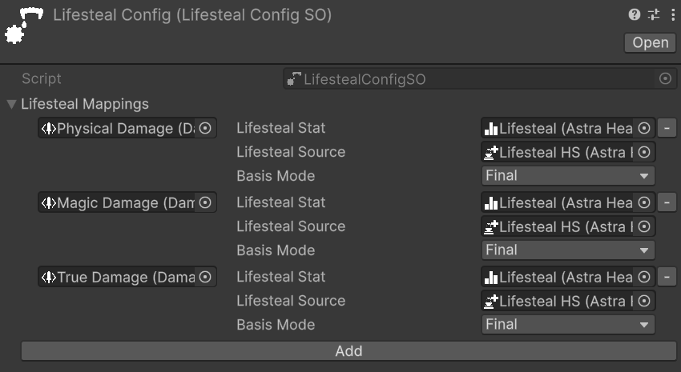
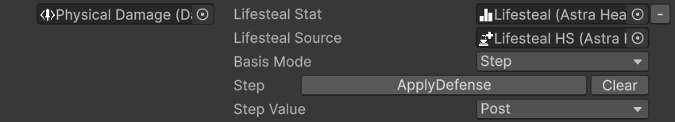

# Lifesteal

Lifesteal is a mechanic that lets an entity recover health proportional to the damage it deals. When an entity successfully damages a target, a percentage of the damage — determined by a configurable stat — is healed back to the attacker. The lifesteal percentage, the heal source used, and which point in the damage pipeline is sampled as the heal basis are all configurable per damage type, giving designers fine-grained control without any additional code.

## Lifesteal Config

*Relative path:* `Astra RPG Health/Lifesteal Config`

The `LifestealConfigSO` is the root asset for lifesteal configuration. It holds a dictionary that maps each `DamageTypeSO` to a `LifestealStatConfig`, defining how lifesteal behaves for that specific damage type. Damage types not present in the dictionary do not trigger lifesteal.

The following image shows an example of a `LifestealConfigSO` with two mappings configured:  

## Configuring Lifesteal Mappings

Each entry in the dictionary pairs a `DamageTypeSO` with a `LifestealStatConfig`. The following image shows what a single mapping looks like in the inspector:  

There are three fields to configure for each mapping:

**Lifesteal Stat**  
The stat that drives the lifesteal percentage. At runtime, the attacker reads this stat value from its own `StatSet` and computes the heal as:
> heal amount = basis damage × (lifesteal stat value / 100)

The stat value is read as a `Percentage` type, meaning the raw `long` value stored in the stat is divided by 100 internally. A stat value of `15` therefore corresponds to 15% lifesteal. For lifesteal to activate, this stat must be present in the dealing entity's `StatSet`.

**Lifesteal Source**  
The `HealSourceSO` used when applying the lifesteal heal. As with any heal in the framework, the heal source determines which heal modifiers — flat and percentage — are applied to the resulting heal, so lifesteal heals can be boosted or reduced by modifiers associated with the configured `HealSourceSO`. See [Heal Source](healing.md#heal-source) for details on `HealSourceSO` configuration.

**Amount Selector**  
Determines which damage value is used as the basis for the lifesteal computation. See [Amount Selector](#amount-selector) below.

### Amount Selector

The Amount Selector controls which damage value is sampled as the lifesteal basis. Three modes are available:

- **Final** *(default)*: uses the damage value after all pipeline steps — the damage actually applied to the target. This is the most intuitive mode for a straightforward "heal for a percentage of damage dealt" mechanic.
- **Initial**: uses the raw damage value before any pipeline modifications. Useful when you want lifesteal to reflect the attacker's power output regardless of the target's defenses — for example, a vampire's lifesteal that scales with their attack power rather than with how much the target's armor reduced.
- **Step**: samples the damage value at a specific pipeline step. You select a step and whether to use the value recorded before (`Pre`) or after (`Post`) that step executes, giving designers precise control over which phase of the calculation drives the heal. Refer to [Damage Calculation Pipeline](damage.md#damage-calculation-pipeline) for an overview of the available pipeline steps.

The following image shows the inspector when Step mode is selected:  

> [!NOTE]
> If **Step** mode is selected but no step is configured, the system falls back to **Final** damage. The inspector displays a warning to indicate this condition.

## Adding Lifesteal to the Package Configuration

Once the `LifestealConfigSO` is set up, assign it to the **Lifesteal Config** field in the `AstraRpgHealthConfigSO`. All entities that share this configuration asset will have lifesteal enabled according to the mappings defined in the assigned `LifestealConfigSO`. See [Lifesteal](package-configuration.md#lifesteal) in the Package Configuration reference for field details.

The following image shows the Lifesteal section of the `AstraRpgHealthConfigSO` in the inspector:  

## Performance Considerations

> [!NOTE]
> Before making any considerations about performance, keep in mind that premature optimization is the root of all evil. A real performance problem should be identified through profiling before taking any action.

By default, lifesteal heals raise the standard healing events (`Pre Heal` and `Entity Healed`). In games where many entities deal lifesteal damage frequently — for example, a horde of enemies all with a lifesteal stat, each landing hits several times per second — the volume of heal events generated can become significant, especially when the global `Entity Healed Event` has multiple listeners.

If profiling reveals this to be a bottleneck, the **Suppress Lifesteal Events** flag in `AstraRpgHealthConfigSO` disables healing event emission for lifesteal heals entirely. The heal is still applied; only the events are suppressed. This option is appropriate when you do not need to react to lifesteal heals through event listeners — for example, when your UI or combat log does not track lifesteal healing specifically.

A similar consideration applies to passive health regeneration, which can also generate a high volume of heal events under certain conditions. See [Performance Considerations](healing.md#performance-considerations) in the Healing documentation for a broader discussion.

## Conditions

> [!NOTE]
> Lifesteal is evaluated after every damage application. The following conditions must all be met for it to trigger:
> - The dealing entity is the source of the damage. Lifesteal does not trigger on damage dealt by others.
> - The dealing entity is alive at the moment of damage resolution.
> - `AstraRpgHealthConfigSO` has a `LifestealConfigSO` assigned.
> - The `DamageTypeSO` of the hit has a mapping in the `LifestealConfigSO`.
> - The configured **Lifesteal Stat** is present in the dealing entity's `StatSet`.
> - The computed heal amount is greater than zero. A lifesteal stat of 0% produces no heal.

> [!IMPORTANT]
> Lifesteal relies on the **Global Damage Resolution Event** being correctly configured on each entity's `EntityHealth`. This event is used by the framework to propagate damage outcomes across all listening entities — including the attacker, which uses it to detect its own successful hits and trigger lifesteal. Assigning a non-global event to this slot will break lifesteal and other framework features that depend on centralized damage communication. See [Global Events](entity-health.md#global-events) for setup details.