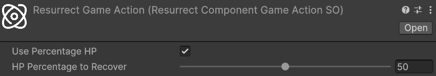

# Resurrection

Resurrection brings a dead entity back to life, restoring it to a playable state with a configurable amount of HP. Unlike healing — which throws an exception when applied to a dead entity — resurrection is exclusively for entities that have already crossed their [death threshold](entity-health.md#death).

The requested HP amount is a **base** value before modifiers. Internally, resurrection routes through the same `Heal` pipeline used for [direct healing](healing.md#direct-healing), so all generic and `HealSourceSO`-specific heal modifiers apply. This means resurrection integrates naturally with any modifier system already in place: a buff that amplifies healing received will equally benefit resurrections, without any additional configuration.

## Package Configuration

Before resurrection can be triggered, two fields in the `AstraRpgHealthConfigSO` need attention:

### Default Resurrection Source

**Type:** `HealSourceSO` — **Required:** Yes

The `HealSourceSO` used automatically by the convenience `Resurrect` overloads and by the built-in [Resurrect Game Action](#the-resurrect-game-action) when no explicit source is provided. It categorises resurrection healing as a distinct type, enabling `HealSourceSO`-specific modifiers to apply. Without this field assigned, the convenience overloads fail at runtime with an assertion error.

See [Heal Source](healing.md#heal-source) for guidance on configuring `HealSourceSO` assets and [Default Resurrection Source](package-configuration.md#default-resurrection-source) in the Package Configuration reference.

### Default On Resurrection Game Action

**Type:** `GameAction<Component>` — **Required:** No

The [Game Action](https://electricdrill.github.io/AstraRpgFrameworkDocs/MD/workflows.html#game-actions) executed automatically whenever any entity is resurrected, unless the entity defines its own [Override On Resurrection Game Action](#per-entity-customization). Use this to implement a common post-resurrection behavior shared across all entities — playing a revival visual effect, re-enabling a disabled GameObject, or resetting specific state. Leave it empty if no shared behavior is needed.

See [Default On Resurrection Game Action](package-configuration.md#default-on-resurrection-game-action) in the Package Configuration reference.

## Resurrecting an Entity

`EntityHealth` implements `IResurrectable`, which exposes three overloads.

**`Resurrect(PreHealContext)`** gives full control over the resurrection: amount, source, and healer entity. It expects a `PreHealContext` built with the same fluent builder used in direct healing:

```csharp
// Assuming:
// - resurrectionSource is the HealSourceSO categorising this resurrection
// - healer is the EntityCore of the character performing the resurrection (null for a system action)
// - target is the EntityCore of the dead entity to resurrect

if (target.TryGetComponent(out EntityHealth targetHealth)) {
    PreHealContext context = PreHealContext.Builder
        .WithAmount(targetHealth.MaxHp / 2)   // 50% of max HP as base amount, before modifiers
        .WithSource(resurrectionSource)
        .WithHealer(healer)
        .WithTarget(target)
        .Build();

    targetHealth.Resurrect(context);
}
```

Refer to [Direct Healing](healing.md#direct-healing) for a detailed explanation of `PreHealContext` and its fluent builder.

**`Resurrect(long)`** and **`Resurrect(Percentage)`** are convenience overloads that build the context automatically using the **Default Resurrection Source** from the configuration and a `null` healer (system-initiated resurrection). Use them when no specific caster is involved and the global default source is appropriate:

```csharp
// Resurrect with a flat HP amount
targetHealth.Resurrect(100L);

// Resurrect with 30% of max HP
Percentage thirtyPercent = 30L;
targetHealth.Resurrect(thirtyPercent);
```

In all cases, the HP amount is the **base** value before heal modifiers are applied. Two constraints are always checked: the base amount must be strictly greater than the entity's death threshold, and must not exceed its maximum HP.

## Heal Modifiers at Resurrection

Because resurrection calls `Heal` internally, the full modifier stack applies:

- **Generic flat heal modifiers** — add or subtract a flat HP amount from the base
- **Generic percentage heal modifiers** — scale the base HP up or down by a percentage
- **`HealSourceSO`-specific modifiers** — flat and percentage modifiers associated with the configured resurrection source

The order of application is the same as described in the [Direct Healing](healing.md#direct-healing) section: first the flat modifiers (generic and `HealSourceSO`-specific) are summed and applied to the base amount, then all percentage modifiers (generic and `HealSourceSO`-specific) are summed and applied to the result.

The entity's HP after resurrection may therefore differ from the base amount requested. `ResurrectionContext.NewValue` always reflects the **actual HP after all modifiers** have been applied.

> [!CAUTION]
> If active negative heal modifiers are strong enough to reduce the effective HP to or below the entity's death threshold, the system applies a fallback and forces HP to `death threshold + 1`, guaranteeing the entity is always resurrected alive. `ResurrectionContext.NewValue` reflects this clamped value.

## The Resurrect Game Action

*Relative path:* `Astra RPG Framework/Game Actions/Context: Component/Resurrect`

`ResurrectComponentGameActionSO` is a ready-made [Game Action](https://electricdrill.github.io/AstraRpgFrameworkDocs/MD/workflows.html#game-actions) that can be dropped into any Game Action slot in the inspector to resurrect an entity. It always uses the **Default Resurrection Source** from the configuration; no source field is exposed in the inspector.

The following image shows the `ResurrectComponentGameActionSO` inspector:  

<!-- IMAGE MISSING: resurrect-game-action.png — screenshot of the ResurrectComponentGameActionSO inspector -->

The configurable fields are:

- **Use Percentage HP**: if enabled, the entity is resurrected with a percentage of its maximum HP; if disabled, a flat HP amount is used instead
- **Percentage HP to Recover**: the percentage of max HP to restore, in the range 0–100. Active only when **Use Percentage HP** is enabled
- **Flat HP to Recover**: the flat HP amount to restore. Active only when **Use Percentage HP** is disabled

> [!NOTE]
> If **Percentage HP to Recover** or **Flat HP to Recover** is set to 0, the game action falls back to resurrecting the entity with exactly 1 HP, guaranteeing the resurrection is always valid.

**Common use case — automatic resurrection after a delay:** combine `ResurrectComponentGameActionSO` with a [Delayed Game Action](https://electricdrill.github.io/AstraRpgFrameworkDocs/api/ElectricDrill.AstraRpgFramework.GameActions.Actions.DelayedGameAction-1.html) inside the entity's **Override On Death Game Action** (or the global **Default On Death Game Action**). When the entity dies, the death game action fires a delayed sequence that triggers the `ResurrectComponentGameActionSO` after a configured number of seconds — implementing an automatic respawn without a single line of code. See the [Game Actions](https://electricdrill.github.io/AstraRpgFrameworkDocs/MD/workflows.html#game-actions) documentation for details on composing and chaining game actions.

## Per-Entity Customization

Each `EntityHealth` component exposes an **Override On Resurrection Game Action** field in its inspector that takes precedence over the **Default On Resurrection Game Action** defined in the configuration. Use it to give specific entities a unique post-resurrection behavior while keeping a sensible global default for everything else.

See [Death](entity-health.md#death) in the Entity Health reference for the full list of per-entity death and resurrection inspector fields.

## Resurrection Events

Resurrecting an entity raises multiple events. Because resurrection routes through `Heal`, the healing events fire first:

- **Pre Heal Event** and **Entity Healed Event** — raised by the internal `Heal` call, carrying the standard healing context before and after modifiers. Subscribe to these if your logic needs to react to the healing component of a resurrection; for example, to trigger a heal-triggered ability even during resurrection
- **Entity Gained Health Event** — raised when the entity's HP increases during the `Heal` call. Useful for general HP-change listeners that do not need the full context of the healing, but just want to know when HP changes and by how much. An example use case is a UI health bar that needs to update whenever HP changes, regardless of the source of the change

After the healing pipeline completes and the resurrection game action has been dispatched:

- **Entity Resurrected Event** — the dedicated resurrection signal, carrying a `ResurrectionContext` with the following fields:
  - **Target**: the `EntityCore` of the resurrected entity (convenience accessor for `ReceivedHeal.Target`)
  - **PreviousValue**: HP immediately before resurrection (at or below the death threshold)
  - **NewValue**: HP after resurrection, computed as `PreviousValue + ReceivedHeal.HealAmount.NetAmount`
  - **AbsAmount**: `NewValue − PreviousValue`
  - **ReceivedHeal**: the full `ReceivedHealContext` produced by the internal `Heal` call, exposing:
    - **HealAmount**: a `HealAmountContext` with `RawAmount` (base amount before modifiers), `AfterModifierAmount` (after flat and percentage modifiers), and `NetAmount` (final HP actually added, capped to max HP)
    - **HealSource**: the `HealSourceSO` used for this resurrection
    - **Source**: the healer `EntityCore` (`null` for system-initiated resurrections, such as those triggered via the convenience overloads or the `ResurrectComponentGameActionSO`)
    - **IsCritical**: whether the resurrection heal was flagged as a critical

Each event is available in both global and extra variants on `EntityHealth`. Use global events when any GameObject in the game needs to receive the signal; use extra events for targeted, component-specific or GO-hierarchy-specific communications. See [Global Events](entity-health.md#global-events) for guidance on choosing between them.
